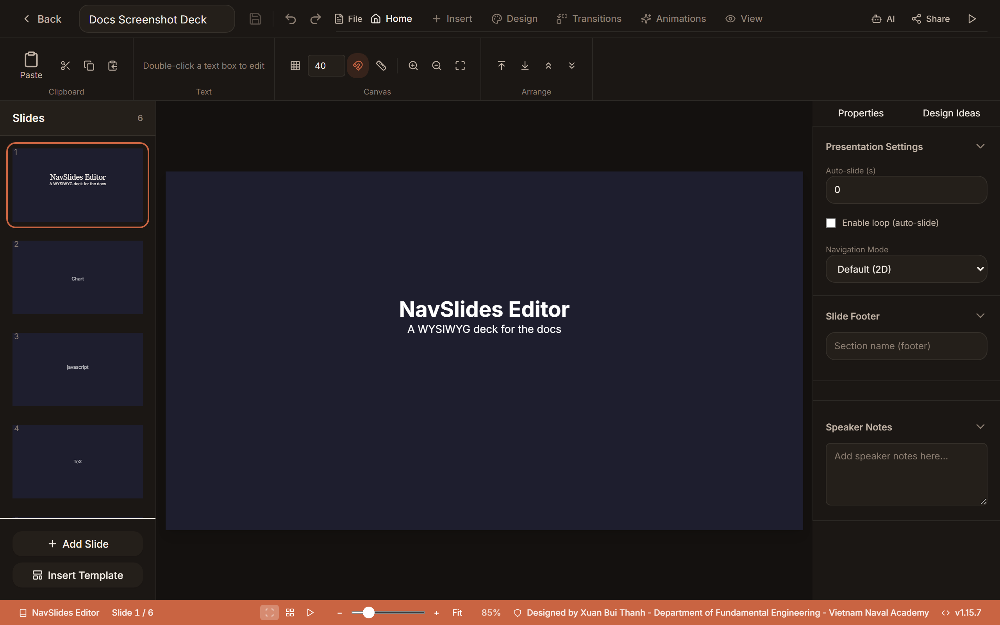
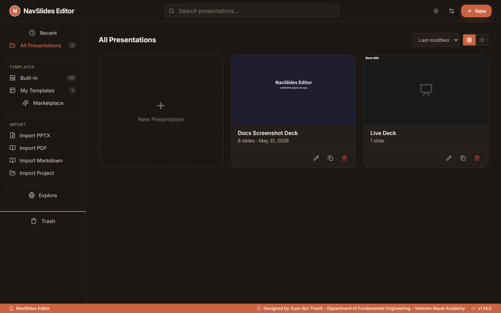
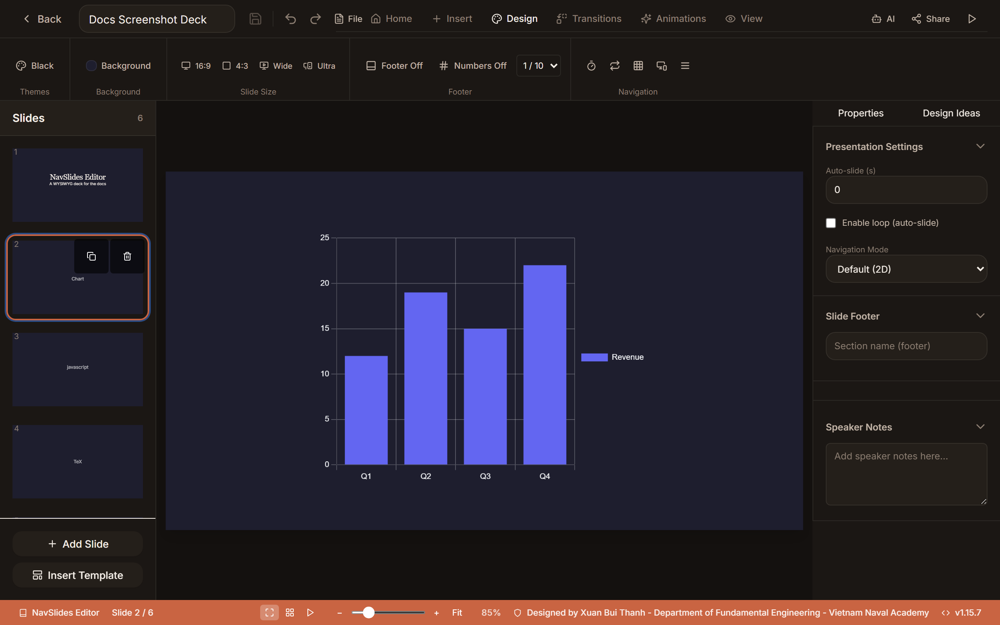
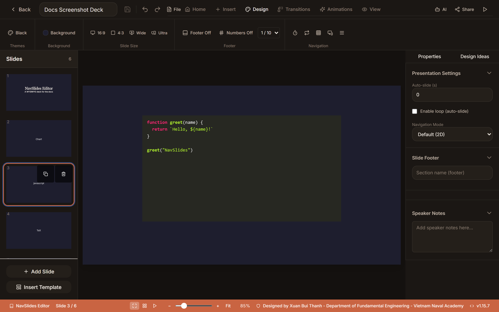

# NavSlides Editor

[](https://github.com/xuan2261/NavSlidesEditor/actions/workflows/github-actions-ci-pipeline-lint-unit-coverage-e2e-load-smoke.yml)
[](https://github.com/xuan2261/NavSlidesEditor/releases/latest)
[](LICENSE)
[](https://github.com/xuan2261/NavSlidesEditor/stargazers)
[](https://github.com/xuan2261/NavSlidesEditor/forks)

A self-hostable WYSIWYG presentation editor powered by [reveal.js](https://revealjs.com/). Build, present, and broadcast slides in the browser — no account, no cloud, no tracking. Also available as a standalone desktop app via Electron.

Current release: **v1.15.7** — improved PPTX export fidelity, editor/live-session resilience, and CI coverage.

<p align="center">
  
</p>

<p align="center">
  <a href="#why-navslides">Why NavSlides</a> ·
  <a href="#quick-start">Quick start</a> ·
  <a href="#visual-tour">Visual tour</a> ·
  <a href="#documentation">Documentation</a> ·
  <a href="#open-source-maintenance">Maintenance</a> ·
  <a href="#features">Features</a> ·
  <a href="#contributing">Contributing</a>
</p>

## Why NavSlides

Most presentation tools trade away privacy, technical authoring, or deployment
control. NavSlides provides an open browser-based alternative for people who
need all three:

- **Local ownership** — presentations stay on the operator's filesystem; the
  default deployment requires no NavSlides account, hosted cloud, or telemetry.
- **Technical authoring** — code, Markdown, LaTeX/TikZ, charts, diagrams, HTML,
  media, and interactive elements live beside ordinary slide content.
- **Portable delivery** — decks can run in the browser, broadcast to live
  viewers, or move through HTML, offline HTML, PDF, PPTX, and project archives.
- **Deployment choice** — the same project runs through Docker, Node.js, or an
  Electron desktop package.

The primary users are academics and researchers, educators and students,
developer speakers, and privacy-conscious operators. The scope is deliberate:
NavSlides is a single-user, self-hosted editor rather than a hosted SaaS or
real-time collaborative document service. Internet-facing deployments therefore
need the external authentication boundary described in the
[Security Model](#security-model) and
[deployment guide](docs/deployment-guide.md).

## Quick start

### Docker (recommended for servers)

Requires Docker 20.10+ and Docker Compose v2+.

```bash
git clone https://github.com/xuan2261/NavSlidesEditor.git && cd NavSlidesEditor
docker compose up -d
```

Open `http://127.0.0.1:3002` by default. Docker listens on `0.0.0.0` inside
the container but publishes to host loopback unless `NAVSLIDES_PUBLISH_HOST`
is set. Use `docker compose logs -f` to inspect the service, or
`docker compose up -d --build` after pulling updates. Internet-facing
deployments require an external authentication layer and reverse proxy.

### Desktop app

Download the pre-built Windows package from
[Releases](https://github.com/xuan2261/NavSlidesEditor/releases). Linux and
macOS packages can be built locally with Node.js 20+:

```bash
git clone https://github.com/xuan2261/NavSlidesEditor.git && cd NavSlidesEditor && npm install
npm run electron:build:linux   # .AppImage + .deb
npm run electron:build:mac     # .zip
npm run electron:build:win     # .exe
npm run electron:dev           # development mode
```

Desktop data is stored under `~/.config/NavSlides Editor/` on Linux,
`~/Library/Application Support/NavSlides Editor/` on macOS, and
`%APPDATA%/NavSlides Editor/` on Windows.

### Node.js from source

Requires Node.js 20+ and npm 8+.

```bash
git clone https://github.com/xuan2261/NavSlidesEditor.git && cd NavSlidesEditor && npm install
npm run dev
```

Development uses Vite on `http://localhost:5173` and the Express API on port
`3002`. For a production-style local run:

```bash
npm run build
npm start
```

### Create your first deck

1. Open the dashboard and select **New Presentation**.
2. Start with a blank deck or choose a template.
3. Click a text element to edit it; use the **Home** and contextual **Format** tabs for styling.
4. Add slides or content from the **Insert** tab. Changes auto-save after a short delay.
5. Select **Present**, **Share**, or **File → Export** when the deck is ready.

## Visual tour

<table>
  <tr>
    <td width="50%">
      
      <br><sub><strong>Dashboard:</strong> create, import, organize, and reopen presentations.</sub>
    </td>
    <td width="50%">
      
      <br><sub><strong>Visual editing:</strong> work with charts, themes, slide settings, and speaker notes in one workspace.</sub>
    </td>
  </tr>
  <tr>
    <td colspan="2">
      
      <br><sub><strong>Technical content:</strong> combine syntax-highlighted code, LaTeX, TikZ, tables, media, and diagrams with ordinary slide content.</sub>
    </td>
  </tr>
</table>

## Documentation

| Resource | English | Tiếng Việt |
| --- | --- | --- |
| Get started | [Getting Started](https://xuan2261.github.io/NavSlidesEditor/guide/getting-started) | [Bắt đầu](https://xuan2261.github.io/NavSlidesEditor/vi/guide/getting-started) |
| Installation | [Installation Guide](https://xuan2261.github.io/NavSlidesEditor/guide/installation) | [Hướng dẫn cài đặt](https://xuan2261.github.io/NavSlidesEditor/vi/guide/installation) |
| First deck | [First Presentation Tutorial](https://xuan2261.github.io/NavSlidesEditor/tutorials/first-presentation) | [Bài trình chiếu đầu tiên](https://xuan2261.github.io/NavSlidesEditor/vi/tutorials/first-presentation) |
| Shortcuts | [Keyboard Shortcuts](https://xuan2261.github.io/NavSlidesEditor/guide/keyboard-shortcuts) | [Phím tắt](https://xuan2261.github.io/NavSlidesEditor/vi/guide/keyboard-shortcuts) |

Maintainer and AI navigation: [project intent](docs/project-overview-pdr.md),
[architecture](docs/system-architecture.md),
[code standards](docs/code-standards.md),
[deployment](docs/deployment-guide.md),
[export/import limits](docs/export-fidelity-and-limits.md), and current
[roadmap](docs/project-roadmap.md) / [changelog](docs/project-changelog.md).

## Open-source maintenance

NavSlides is a public
[AGPL-3.0](https://www.gnu.org/licenses/agpl-3.0.en.html) project maintained by
[@xuan2261](https://github.com/xuan2261), the repository owner and package
author. Releases, verification, architectural decisions, and known limits are
kept inspectable in the repository rather than represented by private service
state.

| Maintenance signal | Evidence |
| --- | --- |
| Public source and copyleft license | [Repository](https://github.com/xuan2261/NavSlidesEditor) · [LICENSE](LICENSE) |
| Tagged releases and desktop artifacts | [GitHub Releases](https://github.com/xuan2261/NavSlidesEditor/releases) · [release workflow](.github/workflows/release.yml) |
| Continuous verification | [CI workflow](.github/workflows/github-actions-ci-pipeline-lint-unit-coverage-e2e-load-smoke.yml) · [testing guide](#testing--performance) |
| Current architecture and trust boundaries | [System architecture](docs/system-architecture.md) · [Security Model](#security-model) · [deployment guide](docs/deployment-guide.md) |
| Planning and change history | [Roadmap](docs/project-roadmap.md) · [changelog](docs/project-changelog.md) |

Maintenance spans the React editor, Express and Socket.IO services, shared
rendering/export code, the Electron shell, and the documentation site.
Automation has the highest leverage in:

- pull-request review and cross-runtime impact analysis;
- issue triage, reproduction, and regression-test design;
- security review of uploads, imports, exports, live capabilities, and
  dependency changes;
- CI failure analysis, release preparation, and documentation-drift checks.

## Features

### Editing

- **WYSIWYG editing** — click and type directly on slides with TipTap rich text
- **Tab-based ribbon UI** — Home / Insert / Design / Transitions / Animations / View tabs replace the old toolbar/menu system; active tab persists across sessions (`Ctrl+Alt+R` toggles). Primary actions (Paste, Text Box, Picture) use large icon-over-label buttons, while constrained widths place lower-frequency groups in an explicit **More** menu
- **Contextual Format tab** — appears only when an element is selected and relabels itself to the selection type (Shape Format / Picture Format / Table Design / Chart Design / Code / Media); auto-activates on the first selection and hides again when the selection clears
- **PowerPoint-style status bar** — zoom slider with −/+/Fit controls, current slide position (Slide X / Y), and a Normal / Slide Sorter / Present view switcher; status bar, ribbon, canvas controls, keyboard shortcuts, and command palette share one zoom state
- **Adaptive editor workspace** — the canvas remains primary across compact, standard, and wide tiers; the slide navigator docks from 1024 px, and Properties / Design Ideas share one right inspector that docks on wide screens and opens as an overlay at narrower widths
- **Accessible slide navigator** — slide thumbnails expose list semantics, stable selection, keyboard focus, and named actions for reordering and vertical slides
- **Rich formatting** — headings, bold/italic/underline/strikethrough, text color, highlight, font family, font size, font weight, line height, alignment, lists, tables, code blocks, links, images, inline math
- **Multi-select** — shift-click to select multiple elements, move or delete them together
- **Group / ungroup** — group multiple elements so they select, move, and resize as a unit (`Ctrl+G` / `Ctrl+Shift+G`)
- **Align & distribute** — align selected elements left/center/right/top/middle/bottom, or distribute evenly
- **Element rotation** — rotate any element by dragging the rotation handle or entering a degree value (`Shift` snaps to 15°)
- **Smart guides & snapping** — alignment lines appear when dragging near other elements' edges or the canvas center; toggle with the magnet icon
- **Rulers & guides** — toggle pixel rulers on the top/left edges; drag from a ruler onto the canvas to place persistent guide lines; double-click a guide to remove it
- **Element controls** — resize, reposition, lock, z-order, drop shadow, aspect-ratio lock (`Shift` while resizing)
- **Round corners** — adjustable border radius on images and code blocks
- **Find & replace** — `Ctrl+F` to search text across all slides with case-sensitive matching, navigate matches, replace one or all
- **Undo / redo** — `Ctrl+Z` / `Ctrl+Y` with 50-step bounded history
- **Clipboard** — `Ctrl+C/X/V` and `Ctrl+D` to copy/cut/paste/duplicate elements
- **Auto-save** — debounced saves every 1.5 s with last-saved timestamp; `Ctrl+S`, the quick-access control, File menu, and command palette dispatch the same immediate save command, while visible transient failures retain a separate `Retry` action
- **Command palette** — `Ctrl+K` for quick command lookup
- **Pointer and touch editing** — mouse, pen, and touch share Pointer Events for selection, drag, resize, rotate, crop, rulers, and guides; 2-finger pinch zoom remains available on tablets and trackpads
- **Translucent presenter UI** — floating tools and slide navigation dim to 15% opacity when idle
- **Interactive onboarding** — step-by-step product tour via React-Joyride
- **Copy URL** — right-click images/videos to copy their resolved media URL

### Element Types

19 element types: text (TipTap rich text), image (upload/URL, crop, filters, round corners), shape (rectangle, circle, triangle, arrow, star), code (10 themes, 25+ languages), LaTeX / TikZ (KaTeX + TikZJax), HTML embeds, Markdown, Chart.js charts (bar, line, pie, doughnut, radar, polar area), video / audio (with start/end trim, playback speed), table (drag-resize, inline editing), QR code, icon (60+ Lucide icons), callout, drawing, line, SVG, timeline, and **game** (10 interactive game types). The Insert ribbon shows 30+ actions because shapes, technical symbol packs, and games (10 variants) expose sub-variants from existing element types. The 19 canonical types are listed in `client/src/data/element-defaults.js`.

### Slides

**35 layouts** across 6 categories (basic, content, layout, data, structure, ending) + 20+ full-deck templates including interactive simulations and quiz decks. Per-slide backgrounds (solid, gradient, image, **animated FX**), **first-class vertical (child) slides** — create, select, edit, and export nested slides from the slide panel — fragment animations with visual timeline editor and preview modal, per-slide page numbers, hidden slides, footer system (basic / sequence modes), and global presentation settings (auto-slide, loop, navigation modes).
### Live Presentation

Broadcast to viewers via Socket.IO with server-issued capabilities. Includes a separate **speaker view** (notes, next-slide preview, timer), **remote control** from a phone or second device, **annotation tools** (pen, laser pointer, highlighter, eraser) that sync to viewers in real time and persist per slide on rejoin, **black/white screen overlays** (`B` / `W`), shared **live timer**, and PowerPoint-style navigation (`F5`, `Home`, `End`, arrows`). Viewer links use `/live/:roomCode`; privileged remote/speaker links carry their capability in the URL fragment. Capability-bearing REST calls use an `Authorization: Bearer` header; URL fragments are never sent in HTTP requests. For multi-user or internet-facing deployments, place them behind the external authentication layer described in the security model below.

### Game Mode

10 interactive game element types with a dedicated player join page (`/player/:slideId/:elementId`), game-specific socket handler, leaderboard, scoring, and presenter shortcuts (HUD, timer, reveal, leaderboard, pause, team select).
The generic `POST /api/games` endpoint is intentionally an unauthenticated local bootstrap boundary; host and player joins or mutations still require server-issued capability and session checks, and multi-user or internet-facing deployments require external authentication.

### AI Tools

AI copywriter (rewrite slide text), AI generator (full presentation drafts from a prompt), AI translate (translate slide content), and a media library with Unsplash and Giphy search.

### Themes & Templates

11 reveal.js base themes (black, white, league, beige, sky, night, serif, simple, solarized, moon, dracula), 6 transitions (none, fade, slide, convex, concave, zoom), **39 token-based design presets** across 7 categories (minimal, editorial, developer, corporate, creative, earthy, bold) surfaced in the Design ribbon ThemeGallery with live-switch and "Apply to all", **8 animated canvas FX backgrounds** (gradient-blob, starfield, matrix-rain, constellation, particle-burst, knowledge-graph, orbit-ring, sparkle-trail) for `type: 'fx'` slide backgrounds, **Design Ideas panel** (heuristic layout + theme suggestions, no AI), custom user templates, and a dark/light editor theme toggle.

### Export & Sharing

Present mode (reveal.js, press `S` for speaker notes), export HTML (CDN-backed), export offline HTML (inlined runtime assets), export PDF (one page per slide with expanded fragments), export PPTX (hybrid: editable primitives + Playwright-rasterized fallback for unsupported elements), shareable links with optional password, GitHub push with auto-generated README, Markdown import, project export/import (`.navslides` archive with manifest v1.1).

Dashboard imports wait for a shared import slot separately from the admitted job's bounded wait. ZIP structure, entry count, declared decompressed size, streamed decompressed-byte budget, and per-entry CRC32 are validated before package mapping. If the final outcome cannot be confirmed, the editor asks you to check existing presentations before retrying rather than making destructive recovery. A completed package job can remain pending visibility until it is safe to open. Imported external media is blocked unless a server administrator explicitly allows its origin; EMF/WMF conversion remains off until that administrator configures its guarded policy.

The import is parser-backed application behavior, not a native PowerPoint/OfficeCLI or pixel-perfect fidelity claim. See [PPTX import lifecycle and evidence](docs/pptx-import-fidelity-report.md#current-import-lifecycle-and-evidence) and [deployment policy](docs/deployment-guide.md#pptx-import-policy).

### Cloud Sync

rclone-based sync to Proton Drive or any rclone-supported provider (Google Drive, S3, etc.). Configure credentials in-app; sync a single presentation or all at once. Docker image ships with rclone preinstalled.

### Version History

Named snapshots saved per presentation, restore any previous version, delete individual snapshots.

## Data & Persistence

All data lives in `server/data/` (presentations, templates, share tokens, GitHub config, settings, analytics, media metadata, history snapshots, rclone config) and `server/uploads/` (media). Docker uses named volumes `revealjs-data` and `revealjs-uploads`. All locations are created automatically on first run.

---

## Security Model

NavSlides Editor is designed as a single-user, self-hosted presentation tool where rich programmable content is a core feature. HTML embeds, custom CSS, inline SVG, Markdown-generated HTML, and exported reveal.js HTML are treated as **trusted author content**.

Code reviews and security scans should not flag trusted author-controlled HTML/CSS/JS execution as a blocking XSS issue by itself. This behavior is intentional because the editor must support interactive embeds, simulations, diagrams, and custom presentation styling.

Still review issues that cross a trust boundary, including:

- untrusted uploads or imported files executing outside the author's intent
- Uploaded SVG content is sanitized on upload and again at the serving boundary, including legacy files, then served with sandbox CSP, `nosniff`, and same-origin resource policy headers.
- public share links exposing admin/editor capabilities
- stored content from one user/session affecting another user
- credential leakage, path traversal, SSRF, command injection, or data loss
- missing auth protections when deploying beyond local/private single-user use

For internet-facing or multi-user deployments, place NavSlides Editor behind an external authentication layer and treat all shared/editable content as privileged.

---

## Save to GitHub

1. Create a [fine-grained PAT](https://github.com/settings/personal-access-tokens/new) with repository contents read/write.
2. Click **GitHub** in the editor, enter owner, repo name, and token → **Save Settings**.
3. Click **Push to GitHub** (optionally with a commit message).

Output structure:
```
my-repo/
├── README.md                          ← auto-generated
├── my_first_talk/
│   ├── presentation.html              ← viewable in browser
│   └── presentation.json              ← full project data
└── another_presentation/
```

---

## Cloud Sync (rclone)

Sync via in-app Sync button. Configure Proton Drive (or any rclone provider) credentials, then use **Sync This Presentation** or **Sync All**. Docker includes rclone; for the desktop app, install rclone separately.

Legacy presentations are exported as HTML + JSON and uploaded via rclone. Package-backed presentations additionally include `package/manifest.json` and verified content-addressed PPTX blobs, so the native package can be recovered from the sync output. Each request uses an isolated staging directory and syncs to a serialized destination. The Docker image includes rclone pre-installed. For the desktop app, install rclone separately on your system.

---

## Reverse Proxy (optional)

**Nginx:**

```nginx
server {
    listen 443 ssl;
    server_name slides.example.com;

    ssl_certificate     /etc/letsencrypt/live/slides.example.com/fullchain.pem;
    ssl_certificate_key /etc/letsencrypt/live/slides.example.com/privkey.pem;

    client_max_body_size 100M;

    location / {
        proxy_pass         http://localhost:3002;
        proxy_http_version 1.1;
        proxy_set_header   Host $host;
        proxy_set_header   X-Real-IP $remote_addr;
        proxy_set_header   X-Forwarded-For $proxy_add_x_forwarded_for;
        proxy_set_header   X-Forwarded-Proto $scheme;
    }
}
```

**Caddy:**

```
slides.example.com {
    reverse_proxy localhost:3002
}
```

---

## Keyboard Shortcuts

### Editor

| Shortcut                       | Action                                |
| ------------------------------ | ------------------------------------- |
| `Ctrl+Z`                       | Undo                                  |
| `Ctrl+Y` / `Ctrl+Shift+Z`      | Redo                                  |
| `Ctrl+C` / `Ctrl+X` / `Ctrl+V` | Copy / cut / paste element            |
| `Ctrl+D`                       | Duplicate element                     |
| `Ctrl+F`                       | Find & replace                        |
| `Ctrl+K`                       | Command palette                       |
| `Ctrl+S`                       | Save now                              |
| `Ctrl+M`                       | Insert new slide                      |
| `Ctrl+G` / `Ctrl+Shift+G`      | Group / ungroup elements              |
| `Ctrl+]` / `Ctrl+[`            | Bring forward / send backward         |
| `Ctrl+0` / `Ctrl++` / `Ctrl+-` | Zoom fit / zoom in / zoom out         |
| `Tab` / `Shift+Tab`            | Cycle through elements                |
| `Delete` / `Backspace`         | Delete selected element(s)            |
| `Escape`                       | Deselect / stop editing / close panel |
| `Shift+drag`                   | Maintain aspect ratio while resizing  |
| `Shift+rotate`                 | Snap rotation to 15-degree increments |
| `Ctrl+Alt+R`                   | Toggle ribbon panel                   |

### Presentation Mode

| Shortcut                     | Action                                  |
| ---------------------------- | --------------------------------------- |
| `F5` / `Shift+F5`            | Start presentation / from current slide |
| `Arrow Left` / `Arrow Right` | Previous / next slide                   |
| `Home` / `End`               | First / last slide                      |
| `B` / `W`                    | Black / white screen overlay            |
| `Escape`                     | End presentation                        |
| `S`                          | Open speaker notes view                 |
| `Ctrl+P`                     | Pen annotation                          |
| `Ctrl+I`                     | Highlighter                             |
| `Y`                          | Laser pointer                           |
| `E`                          | Eraser                                  |

### Game Mode (presenter)

| Shortcut  | Action              |
| --------- | ------------------- |
| `G`       | Toggle HUD          |
| `Space`   | Start / pause timer |
| `Enter`   | Next phase          |
| `R`       | Reveal answer       |
| `L`       | Show leaderboard    |
| `P`       | Pause game          |
| `+` / `-` | Adjust timer        |
| `1`–`4`   | Select team         |

---

## Requirements

| Method       | Requirement                                        |
| ------------ | -------------------------------------------------- |
| Desktop app  | Node.js 20+ (build only)                           |
| Docker       | Docker 20.10+ and Docker Compose v2+               |
| Node.js      | Node.js 20+ and npm 8+                             |
| Load Testing | [k6](https://k6.io/docs/get-started/installation/) |

---

## Testing & Performance

Verification typically runs in this order:

1. Lint and build:
   ```bash
   npm run lint
   npm run build
   ```
2. Unit tests:
   ```bash
   npm run test
   ```
3. Browser tests:
   ```bash
   npm run test:e2e
   ```
4. Parser-relative PPTX corpus metrics:
   ```bash
   npm run test:pptx:corpus-metrics  # `npm run test:corpus` is the compatibility alias
   npm run test:pptx:best-effort     # non-importer-strict metrics plus strict browser smoke
   ```
   This best-effort regression lane measures semantic fidelity and production
   round-trip stability. It does not qualify native importer coverage.
5. Manifest-bound PPTX importer qualification:
   ```bash
   npm run test:pptx:importer-qualification
   npm run test:pptx:strict  # deprecated alias for importer qualification
   ```
   This fail-closed two-pass gate verifies the checked-in 11-deck manifest and
   every source SHA-256, then uses one hash-checked temporary snapshot for
   best-effort native evidence and `{ strict: true }`. Known EMF/native-node
   blockers can make it exit non-zero; that result is truthful, not a release pass.
6. PPTX real-browser layout audit:
   ```bash
   npm run test:pptx:browser-audit        # strict smoke subset for PR/runtime-sensitive checks
   npm run test:pptx:browser-audit:full   # strict full 5-deck release gate
   npm run test:pptx:browser-audit:headed # headed full audit for manual inspection
   ```
7. Load tests with `k6`:
   ```bash
   npm run test:load:api
   npm run test:load:ws
   ```

Install `k6` from the official guide if you want to run the load suite locally.
PPTX browser audit artifacts are written under `plans/reports/pptx-import-real-browser-audit-runs/`, which is ignored by git because screenshots may contain slide content.

### E2E conventions

- Use `testPresentation` from `tests/e2e/fixtures/test-fixtures.js` for presentation create/cleanup.
- Prefer `data-testid` selectors for editor controls, canvas handles, and repeated UI; keep page objects in `tests/e2e/pages/` using kebab-case filenames.
- Use state-based waits: `expect.poll`, locator assertions with timeouts, and `waitForResponse`. Do not add `waitForTimeout`.
- Reuse helper modules such as `tests/e2e/pages/wait-helpers.js` instead of duplicating timing logic.

---

## Tech Stack

| Layer                | Technology                                    |
| -------------------- | --------------------------------------------- |
| Frontend             | React 18, Vite 8, React Router 7              |
| State management     | Zustand (3 stores: editor, presentation, UI)  |
| Rich text editor     | TipTap 2                                      |
| Presentation engine  | reveal.js 5                                   |
| Math rendering       | KaTeX                                         |
| Diagrams             | TikZJax                                       |
| Charts               | Chart.js 4                                    |
| Syntax highlighting  | highlight.js                                  |
| Markdown             | Built-in converter + marked.js (export)       |
| Icons                | Lucide (editor UI) + inline SVG (slide icons) |
| PowerPoint export    | pptxgenjs + Playwright raster fallback        |
| PowerPoint import    | pptxtojson runtime parser; pptx2json benchmark-sandbox-only |
| Backend              | Node.js 20+, Express 4                        |
| Real-time transport  | Socket.IO                                     |
| Desktop app          | Electron 42                                   |
| Cloud sync           | rclone                                        |
| Validation           | Zod (mutation endpoints)                      |
| Testing              | Vitest, Playwright, k6                        |
| Linting & Formatting | ESLint 9 (flat config), Prettier              |
| Storage              | JSON files + local filesystem                 |

---

## Contributing

Contributions are welcome through
[issues](https://github.com/xuan2261/NavSlidesEditor/issues) and
[pull requests](https://github.com/xuan2261/NavSlidesEditor/pulls). For a large
API, persistence, security, or format-compatibility change, open an issue first
so the contract and migration risk are explicit before implementation.

1. Fork the repository and branch from `master`.
2. Install dependencies with `npm install`.
3. Read the relevant [code standards](docs/code-standards.md) and
   [system architecture](docs/system-architecture.md), then change the
   executable owner instead of duplicating behavior in documentation.
4. Run the focused checks for the changed surface and the applicable baseline
   from [Testing & Performance](#testing--performance). `package.json` owns the
   exact commands.
5. Open a focused pull request that explains the problem, decision, behavioral
   and security impact, and verification evidence. Include before/after images
   for visible UI changes and call out persistence or compatibility effects.

Maintainer triage and release ownership currently sit with
[@xuan2261](https://github.com/xuan2261).

---

## License

NavSlides Editor is licensed under the GNU Affero General Public License v3.0. See [LICENSE](LICENSE).
