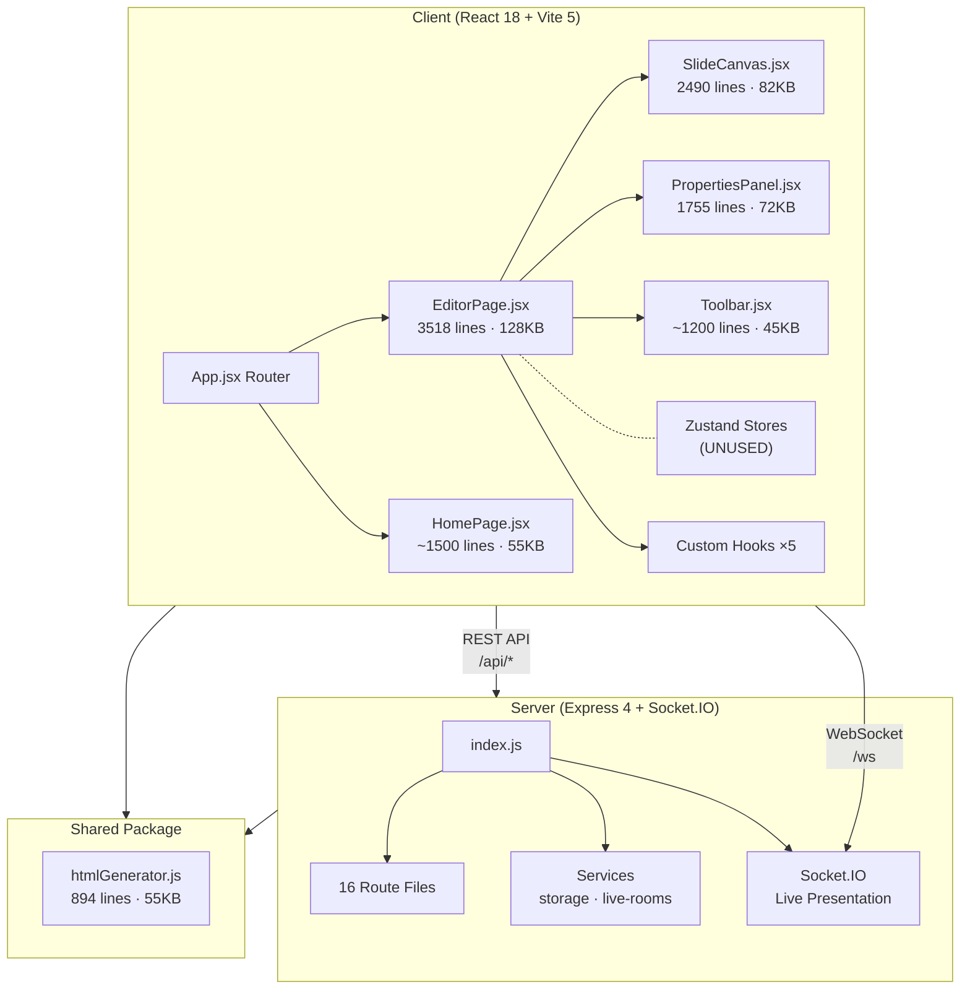
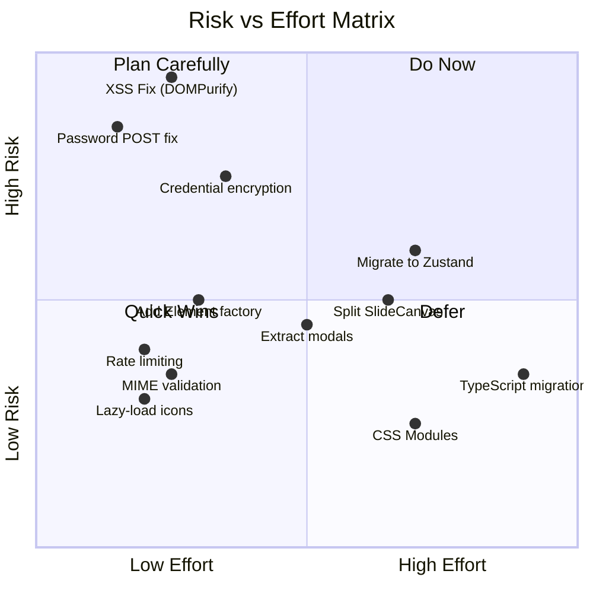

# NavSlides Editor — Consolidated Adversarial Code Review

> **Reviewers:** Antigravity (Primary) + Gemini 3.1 Pro (Cross-ref)  
> **Mode:** Full codebase scan · Adversarial Red-team  
> **Version:** 1.4.2 · **Date:** 2026-04-18  
> **Principles:** YAGNI · KISS · DRY  

---

## 0. Cross-Reference Verdict: Gemini 3.1 Pro Claims

Trước khi vào báo cáo chính, dưới đây là **fact-check** từng claim của Gemini 3.1 Pro:

| # | Gemini Claim | Verdict | Evidence |
|---|-------------|---------|----------|
| 1 | "Không sử dụng Global State Management (Redux, Zustand, Context)" | ⚠️ **Partially Wrong** | Zustand stores **tồn tại** (`editor-store.js`, `presentation-store.js`, `ui-store.js`) nhưng **không được sử dụng**. Gemini bỏ sót fact này. |
| 2 | "Plaintext Secrets: `github-config.json` lưu Access Token plaintext" | ✅ **Confirmed** | [storage.js:9](file:///d:/NCKH_2025/revealjs_gui/server/services/storage.js#L9) → `github-config.json` lưu token dạng plaintext JSON |
| 3 | "Plaintext Secrets: `rclone.conf` lưu credentials plaintext" | ✅ **Confirmed** | [sync.js:48](file:///d:/NCKH_2025/revealjs_gui/server/routes/sync.js#L48) → `password = ${password}` ghi thẳng vào config file |
| 4 | "XSS qua HTML embed + Share Link" | ✅ **Confirmed, Critical** | `htmlGenerator.js:116` — `el.content` embed raw HTML vào iframe `srcdoc`. Kết hợp `/share/:token` → XSS vector |
| 5 | "Mở CORS toàn bộ" | ⚠️ **Partially Wrong** | [index.js:52-54](file:///d:/NCKH_2025/revealjs_gui/server/index.js#L52-L54) — Production: `origin: false` (disabled). Dev: `origin: true` (open). **Chỉ mở CORS ở dev mode**, không phải "mở toàn bộ" |
| 6 | "Upload thiếu validate MIME Type" | ⚠️ **Partially Wrong** | [upload.js:7-12](file:///d:/NCKH_2025/revealjs_gui/server/routes/upload.js#L7-L12) — Có allowlist extension (`.jpg`, `.png`, `.mp4`...) **nhưng** chỉ check extension, **không check magic bytes/MIME header** |
| 7 | "Prop Drilling là vấn đề chính" | ✅ **Confirmed** | EditorPage truyền 40+ props xuống SlideCanvas, PropertiesPanel |
| 8 | "EditorPage ~3500 dòng, ~127KB" | ✅ **Confirmed** | Chính xác: 3,518 lines, 127,785 bytes |
| 9 | "Khuyên dùng Zustand" | ⚠️ **Ironic** | Zustand đã được install + tạo stores rồi — chỉ là chưa migrate state vào |

**Tóm tắt:** 5/9 claims chính xác hoàn toàn, 4/9 thiếu chính xác hoặc bỏ sót nuance. Gemini không kiểm tra code thực tế cho CORS và upload, dẫn tới kết luận quá mức.

---

## 1. Architecture Overview



### Project Scale

| Metric | Value |
|--------|-------|
| Workspaces | `client`, `server`, `shared` (npm workspaces) |
| Frontend source | ~50 `.jsx/.js` files |
| Backend routes | 16 route modules |
| Element types | 14 (text, image, shape, code, LaTeX, HTML, markdown, chart, video, audio, table, icon, callout, QR) |
| CSS | 1 monolith `index.css` (57KB) |
| E2E tests | 20 Playwright specs |
| Data storage | JSON files on disk (no DB) |

---

## 2. 🔴 Critical Findings

### SEC-01: XSS via HTML Embed + Share Links

> [!CAUTION]
> **Severity: Critical** · **Attack surface: Public internet**

**Chuỗi tấn công:**
1. Kẻ xấu tạo presentation chứa HTML element với `<script>` payload
2. Bật share link: `POST /api/presentations/:id/share`
3. Phát tán URL `/share/:token` cho nạn nhân
4. HTML element render **unsanitized** trong iframe `srcdoc`

**Evidence — [htmlGenerator.js:116](file:///d:/NCKH_2025/revealjs_gui/shared/src/htmlGenerator.js#L116):**
```javascript
// el.content chứa RAW HTML không sanitize
if (el.type === 'html') {
  const wrappedContent = `<!doctype html>...<body>${el.content || ''}</body></html>`
  // ↑ Arbitrary HTML injected directly
}
```

**Không có DOMPurify/sanitization** ở bất kỳ đâu trong codebase (đã verify: `grep -r "DOMPurify\|sanitize\|purify\|xss"` → 0 results).

**customCSS cũng là XSS vector — [htmlGenerator.js:408](file:///d:/NCKH_2025/revealjs_gui/shared/src/htmlGenerator.js#L408):**
```javascript
${presentation.customCSS ? `\n  <style>\n${presentation.customCSS}\n  </style>` : ''}
// CSS injection: expression() in old IE, or url() with javascript:
```

**Fix:** Apply DOMPurify cho HTML embed content trước khi render trong share view.

---

### SEC-02: Password Exposed in URL (Share Links)

> [!CAUTION]
> **Severity: Critical** · Confirmed by both reviewers

**[index.js:166-175](file:///d:/NCKH_2025/revealjs_gui/server/index.js#L166-L175):**
```javascript
// Password gửi qua GET query string
if (!req.query.pwd || !(await bcrypt.compare(req.query.pwd, tokenData.password))) {
  return res.send(`
    <form method="GET">  <!-- ← GET, not POST -->
      <input type="password" name="pwd" />
      <button type="submit">View</button>
    </form>
  `)
}
```

Password xuất hiện trong: browser history, URL bar, server logs, HTTP Referer, proxy logs.

**Fix:** Change form method to POST, handle via POST route.

---

### SEC-03: Plaintext Credential Storage

> [!WARNING]
> **Severity: High** · Confirmed by Gemini, verified by code

| File | Content | Risk |
|------|---------|------|
| [github-config.json](file:///d:/NCKH_2025/revealjs_gui/server/services/storage.js#L9) | GitHub PAT token | Full repo access theft |
| rclone.conf ([sync.js:48](file:///d:/NCKH_2025/revealjs_gui/server/routes/sync.js#L48)) | Proton Drive password | Cloud storage compromise |

```javascript
// sync.js:48 — Password written as plaintext
const configContent = `[${name}]\ntype = protondrive\nusername = ${username}\npassword = ${password}\n`
await fs.writeFile(RCLONE_CONFIG_FILE, configContent)
```

**Fix:** 
- Docker/Node: Use `rclone obscure` for password encryption
- Electron: Use OS keychain (`keytar` module)

---

### ARCH-01: God Component — EditorPage.jsx

> [!CAUTION]
> **3,518 lines · 128KB** — Largest single component. Both reviewers flag this as #1 architectural risk.

**Quantified impact:**

| Metric | Count |
|--------|-------|
| `useState` hooks | 60+ |
| `useCallback` functions | 20+ |
| `useEffect` hooks | 15+ |
| Inline modals | 12+ |
| Lines of render JSX | ~2,000 |
| `setPresentation((prev) => ...)` pattern | 25+ occurrences |

**DRY Violation — Add Element Factory:**
Every `add*Element` function (×15 element types) repeats identical `setPresentation` + `slides.map` boilerplate:

```javascript
// This exact pattern repeats 15+ times for each element type
const addXxxElement = useCallback(() => {
  const newEl = { id: crypto.randomUUID(), type: 'xxx', /* defaults */ }
  setPresentation((prev) => ({
    ...prev,
    slides: prev.slides.map((s, i) =>
      i === currentSlideIndexRef.current
        ? { ...s, elements: [...(s.elements || []), newEl] }
        : s
    ),
  }))
  setSelectedElementIds([newEl.id])
}, [])
```

**Fix:** Extract `addElement(type, defaults)` factory function → eliminates ~500 lines.

---

### ARCH-02: Dead Zustand Stores

> [!IMPORTANT]
> 3 Zustand stores exist but are **NEVER imported** by EditorPage

| Store | Size | Status |
|-------|------|--------|
| [editor-store.js](file:///d:/NCKH_2025/revealjs_gui/client/src/stores/editor-store.js) | 52 lines | ❌ Dead code |
| [presentation-store.js](file:///d:/NCKH_2025/revealjs_gui/client/src/stores/presentation-store.js) | 95 lines | ❌ Dead code |
| ui-store.js | ~40 lines | ❌ Dead code |

All state lives in EditorPage's `useState`. **Decision needed:** migrate state → stores, or delete stores.

---

## 3. 🟠 Important Findings

### SEC-04: Upload Extension-Only Validation

**[upload.js:25-29](file:///d:/NCKH_2025/revealjs_gui/server/routes/upload.js#L25-L29):**

```javascript
fileFilter: (req, file, cb) => {
  const ext = path.extname(file.originalname).toLowerCase()  // extension only!
  if (!ALLOWED_UPLOAD_EXTENSIONS.has(ext)) { /* reject */ }
}
```

Gemini said "thiếu validate MIME Type" — **partially correct.** Extension allowlist exists (`.jpg`, `.png`, `.mp4`, `.pdf`...) which blocks `.sh`, `.exe`, `.php`. But:
- Attacker can rename `malware.exe` → `malware.jpg`
- No magic bytes / MIME header validation

**Risk level:** Medium (Node.js won't auto-execute uploaded files, but co-hosting scenarios are dangerous).

### SEC-05: CORS Configuration (Gemini Correction)

Gemini claimed "Mở CORS toàn bộ" — **WRONG for production.**

```javascript
// index.js:52-54
const corsOptions = process.env.NODE_ENV === 'production'
  ? { origin: false }   // ← Production: CORS DISABLED
  : { origin: true }    // ← Dev: CORS open (expected for Vite proxy)
```

**Actual risk:** Low. Dev mode opens CORS (standard for Vite dev server proxy at `:5173` → `:3002`). Production disables it. This is correct behavior.

### ARCH-03: Component Size Violations

| File | Lines | Size | Limit (code standard) |
|------|-------|------|-----------------------|
| [EditorPage.jsx](file:///d:/NCKH_2025/revealjs_gui/client/src/pages/EditorPage.jsx) | 3,518 | 128KB | 200 lines |
| [SlideCanvas.jsx](file:///d:/NCKH_2025/revealjs_gui/client/src/components/SlideCanvas.jsx) | 2,490 | 82KB | 200 lines |
| [PropertiesPanel.jsx](file:///d:/NCKH_2025/revealjs_gui/client/src/components/PropertiesPanel.jsx) | 1,755 | 72KB | 200 lines |
| [htmlGenerator.js](file:///d:/NCKH_2025/revealjs_gui/shared/src/htmlGenerator.js) | 894 | 55KB | 200 lines |
| [HomePage.jsx](file:///d:/NCKH_2025/revealjs_gui/client/src/pages/HomePage.jsx) | ~1,500 | 55KB | 200 lines |

**Total: ~10,200 lines in 5 files** — massively above project's own 200-line standard.

### ARCH-04: Duplicated Clipboard Logic

2 competing implementations:
1. **EditorPage.jsx:1167-1265** — old single-element `keydown` listener
2. **SlideCanvas.jsx:520-577** — new multi-element clipboard

Both listen for `Ctrl+C/V/D` on `document`. Potential event conflict.

### ARCH-05: Duplicated Presentation Lookup (Server)

Pattern "find presentation across 3 sources" repeats 3 times:

| Location | Context |
|----------|---------|
| [index.js:236-253](file:///d:/NCKH_2025/revealjs_gui/server/index.js#L236-L253) | Socket.IO presenter join |
| [index.js:272-292](file:///d:/NCKH_2025/revealjs_gui/server/index.js#L272-L292) | Socket.IO viewer join |
| [presentations.js:286-302](file:///d:/NCKH_2025/revealjs_gui/server/routes/presentations.js#L286-L302) | `/present` endpoint |

**Fix:** Extract `findPresentationById(id)` helper.

### ARCH-06: htmlGenerator.js — Massive DRY Violation

[htmlGenerator.js](file:///d:/NCKH_2025/revealjs_gui/shared/src/htmlGenerator.js) contains **2 near-identical** rendering pipelines:
1. `generateRevealHTML()` — lines 30-508 (live presentation)
2. `generatePrintHTML()` — lines 557-894 (PDF export)

~60% of element rendering logic is **copy-pasted** between them. Each new element type must be added in both functions.

### PERF-01: icon-paths.json — 764KB in JS Bundle

[icon-paths.json](file:///d:/NCKH_2025/revealjs_gui/client/src/data/icon-paths.json) (764KB) is imported statically. This inflates the initial JS bundle significantly.

**Fix:** Dynamic `import()` or split into separate chunk with lazy loading.

---

## 4. 🟡 Moderate Findings

### CODE-01: Hardcoded Slide Dimensions
`960` and `540` appear ~30 times across EditorPage, SlideCanvas, htmlGenerator. Should be constants.

### CODE-02: No Rate Limiting
No `express-rate-limit` or equivalent. Upload endpoint allows 100MB files.

### CODE-03: CSS Monolith (57KB)
Single `index.css` file. No CSS Modules, no component-scoped styles. Selector collision risk.

### CODE-04: Missing Input Validation
`PUT /api/presentations/:id` accepts `req.body` spread directly. No schema validation (Zod/Joi).

### CODE-05: Inline bcrypt Require
`require('bcryptjs')` at [index.js:101](file:///d:/NCKH_2025/revealjs_gui/server/index.js#L101) — middle of file instead of top.

### CODE-06: No TypeScript
14 element types with complex data schemas, all untyped. Refactoring risk is high.

---

## 5. 🟢 Strengths

| Area | Details |
|------|---------|
| **YAGNI compliance** | No unnecessary DB, auth system, or cloud dependencies. JSON-on-disk fits single-user use case perfectly (Gemini concurs) |
| **Feature richness** | 14 element types, 11 themes, fragment animations, multi-select, groups, align/distribute, rulers/guides |
| **Backend modularity** | 16 route files, clean separation of concerns |
| **File locking** | `withFileLock` mechanism prevents race conditions on JSON I/O |
| **Test infrastructure** | Playwright E2E (20 specs), Vitest unit, k6 load testing |
| **Deployment flexibility** | Docker + Node.js + Electron — 3 deployment targets |
| **Auto-save** | Debounced 1.5s auto-save with 50-step undo/redo |
| **Upload security** | Extension allowlist blocks executable uploads |
| **CORS handling** | Correctly disabled in production, open only in dev |
| **Custom hooks** | 5 extracted hooks (autosave, clipboard, history, keyboard, live) |
| **Share security** | Passwords bcrypt-hashed, share tokens UUID-based, expiration support |

---

## 6. Consolidated Risk Matrix



---

## 7. Action Plan (Priority Order)

### Phase 1: Security Patches (1-2 ngày)

| # | Action | Severity | Effort |
|---|--------|----------|--------|
| 1 | **DOMPurify** cho HTML embed trong share/present views | 🔴 Critical | 2 hrs |
| 2 | **POST form** thay GET cho share password | 🔴 Critical | 30 min |
| 3 | **MIME header validation** (magic bytes) cho upload | 🟠 High | 1 hr |
| 4 | `rclone obscure` cho rclone password | 🟠 High | 1 hr |
| 5 | **Rate limiting** middleware (`express-rate-limit`) | 🟡 Medium | 30 min |
| 6 | `customCSS` sanitization (strip `expression()`, `javascript:`) | 🟠 High | 1 hr |

### Phase 2: DRY & Quick Wins (2-3 ngày)

| # | Action | Impact | Effort |
|---|--------|--------|--------|
| 7 | Extract `addElement(type, defaults)` factory | -500 lines EditorPage | 3 hrs |
| 8 | Extract `findPresentationById()` server helper | DRY (3 locations) | 1 hr |
| 9 | Move `bcrypt` import to top of file | Code quality | 5 min |
| 10 | Extract Socket.IO → `services/socket-handler.js` | server/index.js maintainability | 2 hrs |
| 11 | Lazy-load `icon-paths.json` | -764KB initial bundle | 1 hr |

### Phase 3: Component Decomposition (1-2 tuần)

| # | Action | Impact | Effort |
|---|--------|--------|--------|
| 12 | Extract 12 modals → separate components | -800 lines EditorPage | 1 day |
| 13 | Migrate EditorPage state → Zustand stores (or delete unused stores) | Architecture fix | 2-3 days |
| 14 | Split PropertiesPanel by element type → sub-panels | Maintainability | 1 day |
| 15 | Split SlideCanvas → rendering + interaction modules | Maintainability | 1 day |
| 16 | Merge `generateRevealHTML` + `generatePrintHTML` rendering logic | DRY (-300 lines htmlGenerator) | 1 day |

### Phase 4: Long-term (2-4 tuần)

| # | Action | Impact | Effort |
|---|--------|--------|--------|
| 17 | Add request body validation (Zod schemas) | Security + type safety | 2 days |
| 18 | Split `index.css` → CSS Modules per component | Maintainability | 3 days |
| 19 | TypeScript migration (start with data models) | Type safety | 1-2 weeks |
| 20 | Electron: OS keychain for GitHub token (`keytar`) | Security | 1 day |

---

## 8. Final Verdict

> **Architecture:** Dự án có feature set **cực kỳ ấn tượng** cho một WYSIWYG presentation editor tự host. Kiến trúc backend sạch, YAGNI compliance tốt. Tuy nhiên frontend mang technical debt nghiêm trọng tập trung vào **EditorPage.jsx (128KB god component)** — đây là blocker lớn nhất cho việc mở rộng.
>
> **Security:** 3 critical vulnerabilities (XSS via HTML embed, password-in-URL, plaintext credentials) cần fix **ngay lập tức** trước khi expose share links ra internet.
>
> **Gemini 3.1 Pro review:** 5/9 claims chính xác, 4/9 thiếu nuance (CORS, upload validation, Zustand existence). Nhìn chung Gemini đúng hướng nhưng thiếu fact-checking code thực tế ở một số điểm.
>
> **Priority:** Security patches → DRY cleanup → Component decomposition → TypeScript.

---

**Status:** DONE  
**Summary:** Consolidated adversarial review merging Antigravity + Gemini 3.1 Pro analyses. Identified 3 critical security issues, 6 important architectural findings, 6 moderate issues. Fact-checked all 9 Gemini claims with 5 confirmed, 4 partially incorrect.  
**Concerns:** XSS via HTML embed + share links is the most dangerous vulnerability. EditorPage.jsx (128KB) is the biggest architectural risk.
