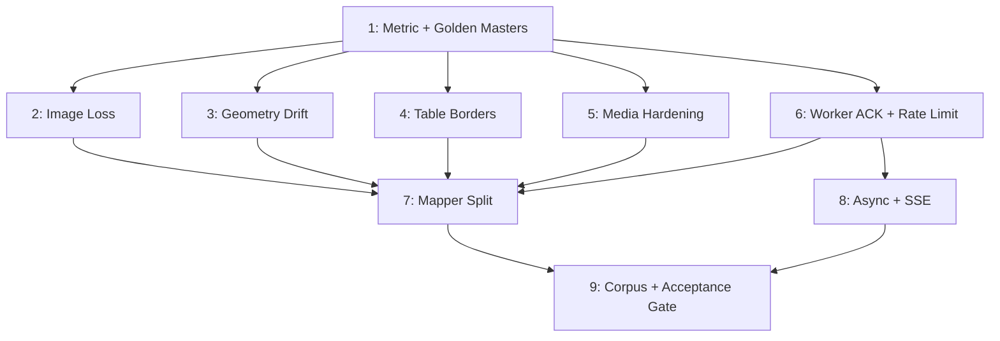

# PPTX Import Full Overhaul — Deep TDD Plan

Fix image loss, geometry drift, dishonest metric, security gaps; split 999-LOC mapper; add async + SSE; expand corpus and lock acceptance gate.

## Phases

| # | Title | Status | Priority | Effort | Depends on |
|---|---|---|---|---|---|
| 1 | TDD foundation: honest metric + golden masters | complete | P1 | 2d | — |
| 2 | Image loss fix (silent null in detectImage) | complete | P1 | 1d | 1 |
| 3 | Shape geometry drift diagnostic + fix | complete | P1 | 3d | 1 |
| 4 | Per-cell table border extraction | complete | P1 | 2d | 1 |
| 5 | Media hardening: SHA256 dedup + extension allowlist | complete | P1 | 2d | 1 |
| 6 | Worker ACK handshake + route rate limit | complete | P1 | 1d | 1 |
| 7 | Mapper split (10 sub-modules, move-in-place) | complete | P1 | 5d | 2,3,4,5,6 |
| 8 | Async import + SSE progress | complete | P1 | 4d | 6 |
| 9 | Corpus expansion + acceptance gate | complete | P1 | 3d | 7,8 |

Total nominal: ~23 days. Phases 2-6 parallelizable after Phase 1.

## Dependency Graph

## Acceptance Gate (enforced by Phase 9)

`npm run test:corpus` (`--roundtrip --strict`) must satisfy ALL:
- Avg semantic fidelity >= 98% AND avg round-trip stability >= 99%
- NO deck below 95% semantic
- NO element-class count drop > 15% (image, shape, table, text, chart, group, diagram, line, other/math)
- All gates pass on n >= 10 corpus decks stored in `server/data/test-corpus/`

## Plan-wide Constraints

- New/modified file <= 180 LOC (target), 200 LOC hard limit per CLAUDE.md
- Kebab-case file names; CJS server-side, ESM tests; no default exports
- Tests co-located with implementation
- Mutable `context` object: pass by reference; never spread/clone — and **REMOVE** existing `{...context}` spreads at `mapper.js:691,746` during Phase 7 Step 8a extraction (they currently violate this invariant)
- `uuidv4` inlined per-file via `() => require('node:crypto').randomUUID()`
- Code comments and filenames must NOT reference plan IDs (P0-A, F13, phase-XX) — explain the why, not the origin
- POST /api/pptx/import response is a breaking change (200 -> 202) — Phase 8 updates route + 5 consumers (HomePage, api.js, api.test.js, pptx-import-fidelity.spec.js, pptx-import-endpoint-roundtrip-...spec.js)
- `file-type` package is ESM-only since v17 — use `await import('file-type')`, NOT `require()`. Pattern in `server/routes/upload.js:93`.
- SHA256 dedup reuses existing `server/data/upload-hashes.json` index from `upload.js:104-133` — do NOT scan `server/uploads/` (2,865+ files → quadratic).
- Media filenames remain `<uuid>.<ext>` for share-link URL enumeration safety; hash is a lookup key, not a filename.

## Red Team Review

Reviewed by 4 hostile lenses (Failure Mode Analyst, Scope & Complexity Critic, Assumption Destroyer, Security Adversary). 40 raw findings → 15 unique after dedup. **All 15 accepted and applied inline to phase files.** 9 scope-cut findings rejected (user mandate: "không có ràng buộc — có thể đại tu").

### Applied findings (15)

| # | Sev | Phase | Issue | Resolution |
|---|---|---|---|---|
| 1 | 🔴 | 5 | `require('file-type')` throws `ERR_REQUIRE_ESM` — package ESM-only since v17 | Use `await import('file-type')`; mirror `upload.js:93` |
| 2 | 🔴 | 2 | `context.warnings.push(...)` plumbing fictional — persist fn signatures don't accept context, 3 callers don't pass it | Use return-value pattern: persist fns return `{url, warning?}`; mapper callers push to existing local arrays |
| 3 | 🔴 | 8 | `req.file.path` deleted in handler `finally` before background worker reads → race | Move cleanup INTO named `runImport(jobId, filePath)` background function's `finally` |
| 4 | 🔴 | 5 | `findByHash` filesystem scan = O(N) over 2,865+ files → quadratic | Reuse `upload-hashes.json` lookup from `upload.js:104-133`; no filesystem scan |
| 5 | 🟠 | 1 | Metric fix mislocated — `propertyCoverage` at 377-385 already correct; real bug is `evaluateCapture` dispatch at 556+ using shape-criteria on latex | Re-point Phase 1 to `evaluateCapture`; add latex/group/diagram dispatch branches |
| 6 | 🟠 | 5 | `mapVideo`/`mapAudio` (mapper.js:436-448, 466-477) pass external `https?://` URLs → tracking-pixel IP/UA leak | Added `gateExternalMediaUrl` with `MEDIA_URL_ALLOWLIST`; warn+drop on external |
| 7 | 🟠 | 6 | `await waitForAck` inside `new Promise(...)` body throws to unhandled-rejection instead of `reject()` | Wrap in `try { await waitForAck } catch (e) { killChild; reject(...) }` |
| 8 | 🟠 | 8 | Breaking-change disclosure missed 3 e2e consumers (api.test.js, pptx-import-fidelity.spec.js, pptx-import-endpoint-roundtrip-...) | Added to File Inventory + Step 5 Tests |
| 9 | 🟠 | 7 | `map-group.js` Step 8 estimate 180 LOC; actual mapper.js:654-862 = 209 LOC overflow | Pre-split into `map-group.js` (group only) + `map-diagram.js` (diagram + connectors). 9 sub-modules → 10 |
| 10 | 🟠 | 5 | `{hash}.{ext}` filenames in public shares enable URL enumeration | Keep `<uuid>.<ext>` filename (matches upload.js:69); hash is separate index key |
| 11 | 🟠 | 6 | "uploadLimiter skips test env" claim FALSE — server/index.js:77-82 has only `max`/`windowMs`, no skip | Add `skip: () => process.env.NODE_ENV === 'test'` to existing limiter |
| 12 | 🟠 | 8 | SSE TTL leak — `cleanupTimer` not cancelled when clients attached → response sockets dropped mid-stream | `attachSseClient` clears pending timer; `detachSseClient` re-schedules only when last client leaves |
| 13 | 🟡 | 5 | SHA256 TOCTOU under concurrent imports | Wrap dedup+write in `withFileLock(hash)` from upload.js:25-32 |
| 14 | 🟡 | 6 | Worker ACK ordering inconsistent — emit-before-handler races | Pin: `process.send({type:'ready'})` AFTER `process.on('message')` registration at parse-worker.js:59 |
| 15 | 🟡 | 9 | Acceptance gate has no abort criterion if Phase 7 breaks geometry; corpus aggregate masks shape drift | Added: STOP and revert if `mapper-golden-master.test.js` snapshot diff post-Phase 7 |

### Rejected (9)

Scope-cut findings rejected on user mandate "no constraints — full overhaul":

- **S2** Replace SSE with poll — Rejected. SSE is the chosen contract; poll-only loses progress UX.
- **S3** 5-file split instead of 10 — Rejected. Per-domain granularity supports targeted testing.
- **S5** Phase 5 split allowlist alone — Rejected. Dedup + magic-bytes are part of agreed media-hardening scope.
- **S6** Phase 3 reduced to 1 day — Rejected. Instrumentation needed for root-cause discovery.
- **S7** Phase 1 fewer test files — Rejected. Golden masters vs corpus baseline tracking are distinct concerns.
- **S8** Phase 6 split into 2 days — Rejected. Both fixes total 1 day; bundling avoids context-switch overhead.
- **S9** Plan-wide +1015 LOC overengineered — Rejected. PPTX import IS untrusted boundary per security constraint; LOC budget already enforced per file.
- **L8** XXE check deferred — Already documented as out-of-scope in plan completion notes; no change.
- **M6** jobId path-traversal — UUIDv4 validator regex already prevents path-component characters.

## Validation Log

### Final Audit — 2026-05-25
**Completed:** Plan sync-back and final targeted verification.

- Reconciled phase checklist states and stale open-question sections with the completed Phase 1-9 evidence.
- Marked top-level plan status complete.
- Verification:
  - `npm run test:corpus` — 10/10 decks passed, avg semantic fidelity 100.0%, avg round-trip stability 99.0%.
  - `npx vitest run server/services/pptx-import-job-manager.test.js server/routes/pptx-import.test.js` — 2 files passed, 12 tests passed.

### Final Reviewer-Fix Validation — 2026-05-25
**Completed:** Closed final code-review concerns and reran acceptance gates.

- Sanitized PPTX table border CSS values in mapper, shared export renderer, and client canvas renderer.
- Kept cancelled imports counted as active until background import settles, preserving the one-running-job resource cap.
- Propagated `AbortSignal` into PPTX package validation and cleaned up newly written media files when abort arrives before or after hash indexing.
- Fixed math/LaTeX HTML cleanup so closing tags are stripped instead of leaking into KaTeX input.
- Verification:
  - `npx vitest run server/services/pptx-import/mapper/map-table.test.js server/services/pptx-import/mapper/map-media.test.js shared/tests/element-renderers.test.js server/services/pptx-import-job-manager.test.js server/routes/pptx-import.test.js server/services/pptx-import/media.test.js` — 6 files passed, 60 tests passed.
  - `npm test` — 182 files passed, 1 skipped; 1527 tests passed, 8 skipped.
  - `npm run test:corpus` — 10/10 decks passed, avg semantic fidelity 100.0%, avg round-trip stability 99.0%.
  - `npm run build` — passed.

### Session 2 — 2026-05-24
**Completed:** Phase 1 and Phase 2.

- Added mapper golden master snapshots and corpus baseline checks.
- Fixed fidelity scoring dispatch for math/latex so it no longer falls through to shape criteria.
- Added `--baseline-out=<path>` support for corpus baseline JSON output.
- Changed PPTX media persistence to return `{ url, warning? }`, preserving warnings without hidden global mutation.
- Preserved EMF/WMF image payloads as uploaded media with limited-browser-support warnings instead of dropping them to placeholders.
- Verification:
  - `npx vitest run server/services/pptx-import/media.test.js server/services/pptx-import/mapper.test.js server/services/pptx-import/mapper-golden-master.test.js --update`
  - `npx vitest run server/services/pptx-import/corpus-baseline.test.js server/services/pptx-import/mapper-golden-master.test.js --update`
  - `npm run test:corpus`
- Latest strict corpus: 4/4 decks passed, avg semantic fidelity 100.0%, avg round-trip stability 99.0%.
- Image retention: `Bai_2_1.pptx` improved to `27 -> 27`; `Bai_2_5.pptx` improved to `31 -> 31`.

### Session 3 — 2026-05-24
**Completed:** Phase 3.

- Added `--drift-out=<path>` support and `shapeDriftDetails` diagnostic rows.
- Diagnosed the large shape drift as a tester source-flattening bug: grouped PPTX children were compared in local group coordinates against absolute NavSlides canvas coordinates.
- Fixed tester source flattening to apply group matrix transforms before geometry comparison.
- Wrote diagnostic report: `plans/260524-1729-pptx-import-review/reports/geometry-drift-diagnostic.md`.
- Evidence files:
  - `reports/shape-drift-baseline.json`
  - `reports/shape-drift-after-source-transform.json`
- Result: `Bai_2_1.pptx` median shape drift `364.5px -> 0px`; `Bai_2_5.pptx` `325.91px -> 0px`; `Bai_2_2.pptx` `121.04px -> 0px`.

### Session 4 — 2026-05-24
**Completed:** Phase 4.

- Added per-cell table border extraction to `mapTable` as `cellStyles.borders[row][col]`.
- Added per-side border rendering in shared present/export table renderer and client canvas table renderer.
- Updated table fidelity scoring to credit `cellStyles.borders` and only require merged cells when source cells declare spans.
- Re-baselined table golden master snapshot and corpus baseline.
- Verification:
  - `npx vitest run server/services/pptx-import shared/tests/element-renderers.test.js`
  - `npm run build`
  - `npm run test:corpus`
- Latest strict corpus: 4/4 decks passed, avg semantic fidelity 100.0%, avg round-trip stability 99.0%; table property coverage is 100.0% on Bai_2_1, Bai_2_2, and Bai_2_5.

### Session 5 — 2026-05-24
**Completed:** Phase 5.

- Added SHA256 dedup for PPTX imported image/media buffers using `server/data/upload-hashes.json`; no `server/uploads` scan.
- Kept public media filenames as `<uuid>.<ext>` and moved dedup/hash-index code into `media-dedup.js` to keep `media.js` under the hard LOC limit.
- Added PPTX media extension allowlist and magic-byte verification with dynamic `await import('file-type')`.
- Rejected `.html`, `.svg`, dotless refs, and magic-byte mismatches with structured warnings before write.
- Hardened external video/audio refs: only localhost, `127.0.0.1`, and same-origin hosts from `PUBLIC_HOST`/`HOST` pass through; other external `http(s)` URLs become locked placeholders with warnings.
- Code review status: `DONE_WITH_CONCERNS`; follow-up test gaps and stale import were fixed. New helper `server/services/pptx-import/media-dedup.js` remains untracked until commit and must be included when landing.
- Verification:
  - `npx vitest run server/services/pptx-import/media.test.js server/services/pptx-import/mapper.test.js`
  - `npx vitest run server/services/pptx-import shared/tests/element-renderers.test.js`
  - `npm run test:corpus`
  - `npm run build`
  - `npm test`
- Latest full suite: 171 files passed, 1 skipped; 1470 tests passed, 9 skipped.
- Latest strict corpus: 4/4 decks passed, avg semantic fidelity 100.0%, avg round-trip stability 99.0%.

### Session 6 — 2026-05-24
**Completed:** Phase 6.

- Added parser worker ACK handshake: child emits `{ type: 'ready' }` after binding the IPC message handler; parent waits before sending `filePath`.
- Added configurable ACK timeout with positive-number validation and controlled `worker-startup-failed` result on missing ACK.
- Added progress IPC guard/forwarding for Phase 8, including controlled failure when `onProgress` throws.
- Moved worker IPC guards/ACK helper into `worker-ipc.js` so `worker-runner.js` stays below hard LOC limit.
- Mounted `uploadLimiter` on `/api/pptx` before the import router, with test-env skip.
- Updated the fidelity tester to call `runParserWorker` directly so ready/progress messages do not break corpus runs.
- Code review status: `DONE_WITH_CONCERNS`; concerns were fixed with tests.
- Verification:
  - `npx vitest run server/services/pptx-import/worker-runner.test.js server/routes/pptx-import.test.js`
  - `npx vitest run server/services/pptx-import server/routes/pptx-import.test.js shared/tests/element-renderers.test.js`
  - `npm run test:corpus`
  - `npm run build`
  - `npm test`
- Latest full suite: 171 files passed, 1 skipped; 1477 tests passed, 9 skipped.
- Latest strict corpus: 4/4 decks passed, avg semantic fidelity 100.0%, avg round-trip stability 99.0%.

### Session 7 — 2026-05-24
**Completed:** Phase 7.

- Split the oversized PPTX mapper into `server/services/pptx-import/mapper/` submodules with `index.js` preserving the `require('./mapper')` export contract.
- Deleted `server/services/pptx-import/mapper.js`; runtime callers continue to resolve the mapper directory barrel.
- Added focused co-located tests for color/text/base utilities, shape/image/table/media/group/diagram/presentation mapping.
- Removed context-clone spreads from group/presentation mapping paths; `zIndex` is set/restored on the shared context object.
- Verified all mapper subfiles are <= 180 LOC; `map-presentation.js` is 178 LOC.
- Verification:
  - `node -e "require('./server/services/pptx-import/mapper/index.js')"`
  - `npx vitest run server/services/pptx-import server/routes/pptx-import.test.js shared/tests/element-renderers.test.js`
  - `npm run test:corpus`
  - `npm run build`
  - `npm test`
- Latest full suite: 181 files passed, 1 skipped; 1503 tests passed, 9 skipped.
- Latest strict corpus: 4/4 decks passed, avg semantic fidelity 100.0%, avg round-trip stability 99.0%.

### Session 8 — 2026-05-25
**Completed:** Phase 8.

- Replaced sync PPTX import response with async `202 { jobId }` and job routes: `GET /api/pptx/jobs/:jobId`, `GET /api/pptx/jobs/:jobId/stream`, and `DELETE /api/pptx/jobs/:jobId`.
- Added in-memory PPTX import job manager with max-one-running enforcement, `Retry-After: 60`, TTL cleanup, SSE client attach/detach, and terminal-state retention while clients are attached.
- Moved temp upload cleanup into background `runImport(...).finally`, preventing handler-finally deletion before worker read.
- Added worker cancellation path: `DELETE` marks job cancelled and aborts parser child through `AbortController`.
- Added worker parse progress, mapper slide mapping progress, and HomePage `EventSource` progress UI with unmount cleanup.
- Updated client API and all known Playwright/API consumers from sync import to async job polling/SSE.
- Verification:
  - `npx vitest run server/services/pptx-import server/services/pptx-import-job-manager.test.js server/routes/pptx-import.test.js client/src/utils/api.test.js shared/tests/element-renderers.test.js`
  - `npm run build`
  - `npm run test:corpus`
  - `npx playwright test tests/e2e/pptx-import-async.spec.js --project=chromium`
  - `npx playwright test tests/e2e/export/pptx-import-endpoint-roundtrip-across-multiple-fixtures.spec.js --project=chromium`
  - `npx playwright test tests/e2e/pptx-import-fidelity.spec.js --project=chromium`
  - `npm test`
  - `npx vitest run --coverage`
- Code review status: `DONE_WITH_CONCERNS`; all four concerns were fixed (pre-multer concurrency reservation, cancel propagation to worker/mapping/media writes, SSE error polling fallback, and route-level SSE lifecycle coverage).
- Latest full suite: 182 files passed, 1 skipped; 1515 tests passed, 9 skipped.
- Latest strict corpus: 4/4 decks passed, avg semantic fidelity 100.0%, avg round-trip stability 99.0%.
- Latest coverage: statements 37.26%, branches 32.03%, functions 31.92%, lines 38.75%.

### Session 9 — 2026-05-25
**Completed:** Phase 9.

- Created default corpus directory `server/data/test-corpus/` with 10 PPTX decks: 4 retained decks from `PPTX/` plus 6 hand-built synthetic decks for charts, process diagrams, background image/notes/footer, math-like rich text, tables, shapes, and media.
- Added `server/data/test-corpus/README.md` documenting fixture source and coverage. Current `pptxtojson` exposes generated chart objects as shape-backed content in metrics, so chart decks are real PPTX chart files but baseline counts them under `shape`.
- Added `.gitignore` exceptions so the new `server/data/test-corpus/` fixtures are tracked while other runtime `server/data/*` files remain ignored.
- Added strict acceptance gates: default corpus fallback, per-deck semantic floor >= 95%, element-class drop <= 15%, strict corpus size >= 10, aggregate semantic >= 98%, aggregate round-trip >= 99%, and CLI flags `--per-deck-min`, `--max-class-drop`, `--exclude-class-drop`.
- Split the corpus CLI into `pptx-import-corpus-cli.js`, keeping the tester at 1299 LOC and preserving direct execution of the old tester file via a shim.
- Updated `package.json` `test:corpus` to use the default corpus instead of hardcoding `./PPTX`.
- Refreshed `corpus-baseline.json` from the strict 10-deck run and added baseline tests for aggregate floors, per-deck semantic floors, class retention, and default corpus resolution.
- Verification:
  - `npx vitest run server/services/pptx-import/corpus-baseline.test.js`
  - `npx vitest run server/services/pptx-import/mapper-golden-master.test.js`
  - `npm run build`
  - `npm run test:corpus`
  - `npm test`
  - `npx vitest run --coverage`
- Final acceptance corpus: 10/10 decks passed, avg semantic fidelity 100.0%, avg round-trip stability 99.0%.
- Final full Vitest/coverage run: 182 files passed, 1 skipped; 1521 tests passed, 8 skipped. Coverage: statements 37.15%, branches 32.01%, functions 31.77%, lines 38.64%.

### Session 1 — 2026-05-24
**Trigger:** Auto-run post-plan validation for `--deep` mode after Red Team Review (Workflow Process Step 7).
**Questions asked:** 4 (Architecture, Tradeoffs, Scope, Risks).

#### Questions & Answers

1. **[Architecture]** Phase 5 hardens video/audio external URLs with a `MEDIA_URL_ALLOWLIST` (default: `localhost`, `127.0.0.1`). How strict for v1?
   **Answer:** Localhost + same-origin (Recommended)
   **Decision:** Extend `MEDIA_URL_ALLOWLIST` at module init to include the server's own host via `process.env.PUBLIC_HOST` (fallback `process.env.HOST`). External hosts still blocked with warning. Settings-page-driven allowlist is out of scope for this plan.

2. **[Tradeoffs]** Phase 8 enforces `MAX_CONCURRENT_RUNNING=1`; second import returns 429. A user with two browser tabs would get rate-limited. Acceptable for v1?
   **Answer:** 1 concurrent + 429 (Recommended)
   **Decision:** Keep `MAX_CONCURRENT_RUNNING=1`. 429 response MUST include `Retry-After: 60` header. Client UI shows "another import is running, please wait".

3. **[Scope]** Phase 9 acceptance gate fails on `element-class drop > 15%`. Bai_2_1 originally lost 30% of images; 15% is a v1 floor. When to tighten to 10%?
   **Answer:** Lock 15% as v1; tighten later (Recommended)
   **Decision:** Ship 15% retention floor as v1 acceptance bar. Follow-up plan v1.1 tightens to 10% after Phase 2/4 prove green on n>=10 corpus.

4. **[Risks]** Phase 3 (geometry drift) is 'instrument-first': diagnose before fixing. If diagnostic reveals the root cause is upstream `pptxtojson` (we can't fix), what's the contingency?
   **Answer:** Document + warning, no fix (Recommended)
   **Decision:** Contingency path (Sub-step B.fallback): emit per-shape `geometry-drift-detected` warning to import dialog when shape drift > 50px; document upstream limitation in `reports/geometry-drift-diagnostic.md`; relax Phase 9 acceptance gate to exclude `shape` class drop check IF AND ONLY IF diagnostic proves upstream root cause.

#### Impact on Phases

- **Phase 3** — Added explicit Sub-step B.fallback for upstream root cause (warning + acceptance-gate exception). Q1 promoted from Unresolved → concrete contingency.
- **Phase 5** — Extended `MEDIA_URL_ALLOWLIST` init to read `process.env.PUBLIC_HOST` / `process.env.HOST` at module load (~5 LOC).
- **Phase 8** — `Retry-After: 60` header explicitly required on 429 response.
- **Phase 9** — Risk Assessment notes 15% locked as v1; v1.1 follow-up tightens to 10%.

## Completion Notes

1. Image-loss instrumentation and fix completed in Phase 2; measured corpus image retention restored.
2. `other`/latex metric dispatch fixed in Phase 1 and locked by corpus baseline coverage.
3. Shape drift distribution was diagnosed in Phase 3 as grouped-source comparison drift; median measured drift dropped to 0px on the affected decks.
4. XXE handling in upstream `pptxtojson` remains out of scope and should be handled by a separate security follow-up.
5. Background-image import coverage is represented in the Phase 9 corpus; true gaps beyond the current parser output remain follow-up scope.
6. Express/Vite SSE behavior was verified through the Phase 8 async import Playwright flow after proxy timeout configuration.
7. Manual >5MB UI progress verification remains a non-blocking follow-up because checked-in fixtures are intentionally below 5MB.
