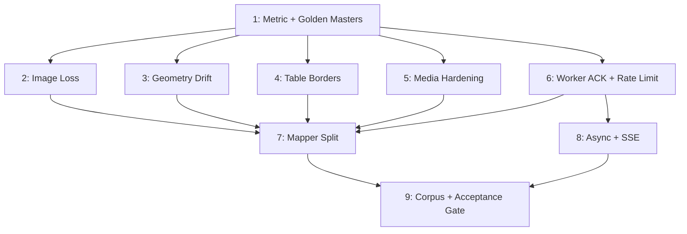

# PPTX Import Full Overhaul — Deep TDD Plan

Fix image loss, geometry drift, dishonest metric, security gaps; split 999-LOC mapper; add async + SSE; expand corpus and lock acceptance gate.

## Phases

| # | Title | Status | Priority | Effort | Depends on |
|---|---|---|---|---|---|
| 1 | TDD foundation: honest metric + golden masters | pending | P1 | 2d | — |
| 2 | Image loss fix (silent null in detectImage) | pending | P1 | 1d | 1 |
| 3 | Shape geometry drift diagnostic + fix | pending | P1 | 3d | 1 |
| 4 | Per-cell table border extraction | pending | P1 | 2d | 1 |
| 5 | Media hardening: SHA256 dedup + extension allowlist | pending | P1 | 2d | 1 |
| 6 | Worker ACK handshake + route rate limit | pending | P1 | 1d | 1 |
| 7 | Mapper split (10 sub-modules, move-in-place) | pending | P1 | 5d | 2,3,4,5,6 |
| 8 | Async import + SSE progress | pending | P1 | 4d | 6 |
| 9 | Corpus expansion + acceptance gate | pending | P1 | 3d | 7,8 |

Total nominal: ~23 days. Phases 2-6 parallelizable after Phase 1.

## Dependency Graph

## Acceptance Gate (enforced by Phase 9)

`npm run test:corpus` (`--roundtrip --strict`) must satisfy ALL:
- Avg semantic fidelity >= 98% AND avg round-trip stability >= 99%
- NO deck below 95% semantic
- NO element-class count drop > 15% (image, shape, table, text, chart, group, diagram, line, other/math)
- All gates pass on n >= 10 corpus decks stored in `server/data/test-corpus/`

## Plan-wide Constraints

- New/modified file <= 180 LOC (target), 200 LOC hard limit per CLAUDE.md
- Kebab-case file names; CJS server-side, ESM tests; no default exports
- Tests co-located with implementation
- Mutable `context` object: pass by reference; never spread/clone — and **REMOVE** existing `{...context}` spreads at `mapper.js:691,746` during Phase 7 Step 8a extraction (they currently violate this invariant)
- `uuidv4` inlined per-file via `() => require('node:crypto').randomUUID()`
- Code comments and filenames must NOT reference plan IDs (P0-A, F13, phase-XX) — explain the why, not the origin
- POST /api/pptx/import response is a breaking change (200 -> 202) — Phase 8 updates route + 5 consumers (HomePage, api.js, api.test.js, pptx-import-fidelity.spec.js, pptx-import-endpoint-roundtrip-...spec.js)
- `file-type` package is ESM-only since v17 — use `await import('file-type')`, NOT `require()`. Pattern in `server/routes/upload.js:93`.
- SHA256 dedup reuses existing `server/data/upload-hashes.json` index from `upload.js:104-133` — do NOT scan `server/uploads/` (2,865+ files → quadratic).
- Media filenames remain `<uuid>.<ext>` for share-link URL enumeration safety; hash is a lookup key, not a filename.

## Red Team Review

Reviewed by 4 hostile lenses (Failure Mode Analyst, Scope & Complexity Critic, Assumption Destroyer, Security Adversary). 40 raw findings → 15 unique after dedup. **All 15 accepted and applied inline to phase files.** 9 scope-cut findings rejected (user mandate: "không có ràng buộc — có thể đại tu").

### Applied findings (15)

| # | Sev | Phase | Issue | Resolution |
|---|---|---|---|---|
| 1 | 🔴 | 5 | `require('file-type')` throws `ERR_REQUIRE_ESM` — package ESM-only since v17 | Use `await import('file-type')`; mirror `upload.js:93` |
| 2 | 🔴 | 2 | `context.warnings.push(...)` plumbing fictional — persist fn signatures don't accept context, 3 callers don't pass it | Use return-value pattern: persist fns return `{url, warning?}`; mapper callers push to existing local arrays |
| 3 | 🔴 | 8 | `req.file.path` deleted in handler `finally` before background worker reads → race | Move cleanup INTO named `runImport(jobId, filePath)` background function's `finally` |
| 4 | 🔴 | 5 | `findByHash` filesystem scan = O(N) over 2,865+ files → quadratic | Reuse `upload-hashes.json` lookup from `upload.js:104-133`; no filesystem scan |
| 5 | 🟠 | 1 | Metric fix mislocated — `propertyCoverage` at 377-385 already correct; real bug is `evaluateCapture` dispatch at 556+ using shape-criteria on latex | Re-point Phase 1 to `evaluateCapture`; add latex/group/diagram dispatch branches |
| 6 | 🟠 | 5 | `mapVideo`/`mapAudio` (mapper.js:436-448, 466-477) pass external `https?://` URLs → tracking-pixel IP/UA leak | Added `gateExternalMediaUrl` with `MEDIA_URL_ALLOWLIST`; warn+drop on external |
| 7 | 🟠 | 6 | `await waitForAck` inside `new Promise(...)` body throws to unhandled-rejection instead of `reject()` | Wrap in `try { await waitForAck } catch (e) { killChild; reject(...) }` |
| 8 | 🟠 | 8 | Breaking-change disclosure missed 3 e2e consumers (api.test.js, pptx-import-fidelity.spec.js, pptx-import-endpoint-roundtrip-...) | Added to File Inventory + Step 5 Tests |
| 9 | 🟠 | 7 | `map-group.js` Step 8 estimate 180 LOC; actual mapper.js:654-862 = 209 LOC overflow | Pre-split into `map-group.js` (group only) + `map-diagram.js` (diagram + connectors). 9 sub-modules → 10 |
| 10 | 🟠 | 5 | `{hash}.{ext}` filenames in public shares enable URL enumeration | Keep `<uuid>.<ext>` filename (matches upload.js:69); hash is separate index key |
| 11 | 🟠 | 6 | "uploadLimiter skips test env" claim FALSE — server/index.js:77-82 has only `max`/`windowMs`, no skip | Add `skip: () => process.env.NODE_ENV === 'test'` to existing limiter |
| 12 | 🟠 | 8 | SSE TTL leak — `cleanupTimer` not cancelled when clients attached → response sockets dropped mid-stream | `attachSseClient` clears pending timer; `detachSseClient` re-schedules only when last client leaves |
| 13 | 🟡 | 5 | SHA256 TOCTOU under concurrent imports | Wrap dedup+write in `withFileLock(hash)` from upload.js:25-32 |
| 14 | 🟡 | 6 | Worker ACK ordering inconsistent — emit-before-handler races | Pin: `process.send({type:'ready'})` AFTER `process.on('message')` registration at parse-worker.js:59 |
| 15 | 🟡 | 9 | Acceptance gate has no abort criterion if Phase 7 breaks geometry; corpus aggregate masks shape drift | Added: STOP and revert if `mapper-golden-master.test.js` snapshot diff post-Phase 7 |

### Rejected (9)

Scope-cut findings rejected on user mandate "no constraints — full overhaul":

- **S2** Replace SSE with poll — Rejected. SSE is the chosen contract; poll-only loses progress UX.
- **S3** 5-file split instead of 10 — Rejected. Per-domain granularity supports targeted testing.
- **S5** Phase 5 split allowlist alone — Rejected. Dedup + magic-bytes are part of agreed media-hardening scope.
- **S6** Phase 3 reduced to 1 day — Rejected. Instrumentation needed for root-cause discovery.
- **S7** Phase 1 fewer test files — Rejected. Golden masters vs corpus baseline tracking are distinct concerns.
- **S8** Phase 6 split into 2 days — Rejected. Both fixes total 1 day; bundling avoids context-switch overhead.
- **S9** Plan-wide +1015 LOC overengineered — Rejected. PPTX import IS untrusted boundary per security constraint; LOC budget already enforced per file.
- **L8** XXE check deferred — Already documented as out-of-scope in plan Open Questions; no change.
- **M6** jobId path-traversal — UUIDv4 validator regex already prevents path-component characters.

## Validation Log

### Session 1 — 2026-05-24
**Trigger:** Auto-run post-plan validation for `--deep` mode after Red Team Review (Workflow Process Step 7).
**Questions asked:** 4 (Architecture, Tradeoffs, Scope, Risks).

#### Questions & Answers

1. **[Architecture]** Phase 5 hardens video/audio external URLs with a `MEDIA_URL_ALLOWLIST` (default: `localhost`, `127.0.0.1`). How strict for v1?
   **Answer:** Localhost + same-origin (Recommended)
   **Decision:** Extend `MEDIA_URL_ALLOWLIST` at module init to include the server's own host via `process.env.PUBLIC_HOST` (fallback `process.env.HOST`). External hosts still blocked with warning. Settings-page-driven allowlist is out of scope for this plan.

2. **[Tradeoffs]** Phase 8 enforces `MAX_CONCURRENT_RUNNING=1`; second import returns 429. A user with two browser tabs would get rate-limited. Acceptable for v1?
   **Answer:** 1 concurrent + 429 (Recommended)
   **Decision:** Keep `MAX_CONCURRENT_RUNNING=1`. 429 response MUST include `Retry-After: 60` header. Client UI shows "another import is running, please wait".

3. **[Scope]** Phase 9 acceptance gate fails on `element-class drop > 15%`. Bai_2_1 originally lost 30% of images; 15% is a v1 floor. When to tighten to 10%?
   **Answer:** Lock 15% as v1; tighten later (Recommended)
   **Decision:** Ship 15% retention floor as v1 acceptance bar. Follow-up plan v1.1 tightens to 10% after Phase 2/4 prove green on n>=10 corpus.

4. **[Risks]** Phase 3 (geometry drift) is 'instrument-first': diagnose before fixing. If diagnostic reveals the root cause is upstream `pptxtojson` (we can't fix), what's the contingency?
   **Answer:** Document + warning, no fix (Recommended)
   **Decision:** Contingency path (Sub-step B.fallback): emit per-shape `geometry-drift-detected` warning to import dialog when shape drift > 50px; document upstream limitation in `reports/geometry-drift-diagnostic.md`; relax Phase 9 acceptance gate to exclude `shape` class drop check IF AND ONLY IF diagnostic proves upstream root cause.

#### Impact on Phases

- **Phase 3** — Added explicit Sub-step B.fallback for upstream root cause (warning + acceptance-gate exception). Q1 promoted from Unresolved → concrete contingency.
- **Phase 5** — Extended `MEDIA_URL_ALLOWLIST` init to read `process.env.PUBLIC_HOST` / `process.env.HOST` at module load (~5 LOC).
- **Phase 8** — `Retry-After: 60` header explicitly required on 429 response.
- **Phase 9** — Risk Assessment notes 15% locked as v1; v1.1 follow-up tightens to 10%.

## Open Questions (carry from findings section 6)

1. Image-loss instrument: which path nulls in `media.js:71` for the 8 lost images on `Bai_2_1`? Phase 3 + Phase 2 must add diagnostic logging before fix.
2. What pptxtojson types map to `other`? Suspected math/equation; confirm in Phase 1 metric refactor.
3. Shape drift distribution: one bad group vs spread across all shapes? Phase 3 instrumentation must emit per-shape drift.
4. XXE in pptxtojson parser: unverified; out of scope for this plan, raise as follow-up.
5. `other -> latex` round-trip 100% stable but 0% property coverage — Phase 1 fixes metric.
6. Background images: confirmed missing or just deprioritized? Out of this plan, log in P2-L follow-up.
7. Express/Vite proxy SSE timeout in dev — verify in Phase 8.
