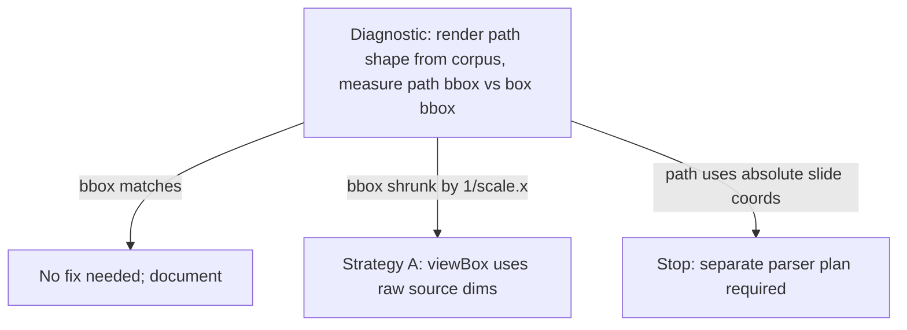

# Phase 4: SVG path scaling verification

## Context Links

- File: `server/services/pptx-import/mapper/map-shape.js:10-22`
- Snippet:
  ```js
  if (element.path) {
    const rawWidth = Math.max(1, readNumber(element.width, 80))
    const rawHeight = Math.max(1, readNumber(element.height, 40))
    return `<svg width="100%" height="100%" viewBox="0 0 ${rawWidth} ${rawHeight}" preserveAspectRatio="none" ...><path d="${svgAttr(element.path)}" ...`
  }
  ```

## Overview

**Priority:** P1
**Current status:** implemented — diagnostic confirmed local path coordinates; Strategy A applied
**Brief:** The original audit found that custom SVG paths used a scaled `viewBox` (`0 0 ${scaledWidth} ${scaledHeight}`) while inserting the raw `element.path` string verbatim. The implemented fix keeps the `viewBox` in raw source dimensions, lets the child SVG fill the canvas-scaled wrapper, and converts custom-path stroke width once in raw viewBox units.

The audit flagged this as "needs verify"; diagnostic evidence confirmed local source-coordinate paths, so Strategy A was applied.

## Key Insights

- SVG viewBox semantics: `viewBox="0 0 W H"` declares the user-coordinate system. The path's numeric values are in user units. So if path is in pt and viewBox is in scaled px, the path is rendered shrunk by `1/scale.x` along the x-axis (because the same path coordinates now map to `1/scale.x` fewer viewBox units).
- pptxtojson normalises shape paths to fit the shape's bounding box (often `0..width` or `0..1`), but documentation is ambiguous.
- Two correct strategies:
  - **A.** Set viewBox to the raw source dimensions: `viewBox="0 0 ${rawWidth} ${rawHeight}"`. Path renders correctly because user units match path units. SVG element wrapping div is sized to scaled-px width/height (preserveAspectRatio handles stretching).
  - **B.** Scan the path with a parser, multiply all coord values by `scale.x` / `scale.y`. More complex; preferred only if path coords use absolute slide coordinates instead of shape-local coords.

Diagnostic test will determine which strategy applies.

## Requirements

**Functional:**

- After Phase 4, SVG-path shapes from PPTX render at the exact box position and size given by `mapBox` on the canvas, with the path geometry occupying the full box width/height.
- Round-trip export of a path shape preserves the original visual.

**Non-functional:**

- No behavior change for shapes that come through the `shape` (non-path) branch.

## Architecture

Diagnostic-first:



## Related Code Files

**Modified:**

- `server/services/pptx-import/mapper/map-shape.js` — applies raw-dimension custom path SVG mapping.
- `server/services/pptx-import/mapper/map-shape.test.js` — covers raw viewBox, child SVG sizing, and nonzero custom path stroke.
- `plans/260525-1450-pptx-import-unit-conversion-and-scale-fixes/reports/svg-path-scaling-diagnostic.md` — records diagnostic evidence.

**Read for context:**

- pptxtojson documentation: search `node_modules/pptxtojson/README.md` for `path` field semantics.
- Any corpus deck that contains a custom path shape (e.g., free-form shape).

**Create:**

- `plans/260525-1450-pptx-import-unit-conversion-and-scale-fixes/reports/svg-path-scaling-diagnostic.md`

**Delete:**

- None.

## Implementation Steps

### Step 1 — Diagnostic contract test

Write a unit test that imports a synthetic pptxtojson output containing a `path` shape with known source dimensions and a path string spanning the full bbox. Do not use JSDOM `getBBox`; JSDOM does not perform real SVG layout. Unit tests should assert the mapped SVG `viewBox`, wrapper dimensions, `preserveAspectRatio`, and path attribute. Rendered bbox measurement belongs in a Playwright/browser test.

```js
test('SVG path shape renders at full box dimensions', () => {
  const output = {
    size: { width: 720, height: 540 }, // 4:3 -- scale.x = 4/3
    slides: [{ elements: [{
      type: 'shape', shapType: 'custom',
      left: 0, top: 0, width: 60, height: 60, // pt
      path: 'M 0 0 L 60 0 L 60 60 L 0 60 Z', // assumed pt
    }] }],
  }
  // ... after mapping, parse the SVG string/attributes
  expect(svg.getAttribute('viewBox')).toBe('0 0 80 80') // current behavior before diagnostic decision
  expect(path.getAttribute('d')).toBe('M 0 0 L 60 0 L 60 60 L 0 60 Z')
})
```

Run — observe failure mode:

- If Playwright/browser measurement shows the path occupies 60px inside an 80px wrapper → Strategy A.
- If browser measurement shows the path visually fills the wrapper despite raw local path coords → document no code change.

### Step 2 — Investigate pptxtojson path output

```bash
node -e "const p = require('pptxtojson'); /* parse a corpus deck and console.log a shape with .path */"
```

Confirm whether path coords are local (0..width) or absolute (slide-level).

Write findings to `reports/svg-path-scaling-diagnostic.md`.

### Step 3 — Green: apply Strategy A if confirmed

```js
if (element.path) {
  const rawWidth = readNumber(element.width, 80)
  const rawHeight = readNumber(element.height, 40)
  const strokeWidth = scaleLength(element.borderWidth)
  // viewBox in source-pt; outer element box scaled to canvas-px via mapBox + baseElement
  return [{
    ...baseElement(element, context.scale, context.zIndex, mapBox(element, context.scale)),
    type: 'svg',
    content: `<svg width="100%" height="100%" viewBox="0 0 ${rawWidth} ${rawHeight}" preserveAspectRatio="none" xmlns="http://www.w3.org/2000/svg"><path d="${svgAttr(element.path)}" fill="${svgAttr(fill)}" stroke="${svgAttr(stroke)}" stroke-width="${strokeWidth}"/></svg>`,
  }]
}
```

`preserveAspectRatio="none"` lets the path stretch with the box on non-square scales.

### Step 4 — Strategy B fallback is out of scope for this plan

Do not add a custom SVG path parser or new dependency in this plan. If Step 2 proves absolute slide-coordinate paths, stop after writing the diagnostic report and open a separate focused plan. This phase may only apply Strategy A (raw-dimension `viewBox`) when a real fixture proves local path coordinates are being mis-scaled.

### Step 5 — Verification

```bash
npx vitest run server/services/pptx-import/mapper/map-shape.test.js
npx playwright test tests/e2e/pptx-import-visual-fidelity.spec.js --project=chromium --grep "custom path"
npm run test:corpus
```

If a corpus deck contains a custom-path shape, snapshot the path output and lock it.

## Evidence

- Diagnostic report: `reports/svg-path-scaling-diagnostic.md`.
- `pptxtojson` path generation uses local `width` / `height` values, so custom path SVGs now keep the inner `viewBox` in raw source dimensions.
- Generated SVGs include `width="100%" height="100%" preserveAspectRatio="none"` so the child SVG fills the canvas-scaled wrapper.
- Custom-path `stroke-width` converts PPTX `pt` to `px` once in raw viewBox units; the wrapper/viewBox transform then applies source-to-canvas scaling.
- Verification passed:
  - `npx vitest run server/services/pptx-import/mapper/map-shape.test.js server/services/pptx-import/mapper.test.js server/services/pptx-import/mapper-golden-master.test.js` — 3 files / 138 tests.
  - `npm run test:corpus` — 11/11 decks, 100.0% semantic, 100.0% round-trip.
  - `npm run build` — pass.
  - `npm run lint` — 0 errors, 7 unrelated warnings from the untracked debug script.
  - Tester gate: DONE.
  - Code-reviewer fix-diff gate: DONE.

## Todo List

- [x] Step 1: write diagnostic test, observe current failure mode
- [x] Step 2: investigate pptxtojson path field; write diagnostic report
- [x] Step 3: implement Strategy A (raw-dim viewBox) if confirmed
- [x] Step 4: absolute coords were not confirmed; no parser plan needed
- [x] Step 5: corpus + golden-master regression
- [x] Add a custom-path shape to a corpus fixture if none exist

## Success Criteria

- Diagnostic report exists, explicitly states which strategy applies and why.
- Custom-path shape from corpus renders with the path filling the box across 16:9 and 4:3 decks.

## Risk Assessment

| Risk | Likelihood | Impact | Mitigation |
|------|------------|--------|------------|
| pptxtojson doesn't expose path on shapes we have → bug is theoretical | M | L | Strategy A is a safe default even if no current corpus deck exercises it. Document as "preventative". |
| Absolute-coordinate paths require a parser | M | M | Out of scope here. Stop after diagnostic and create a separate parser plan. |
| `preserveAspectRatio="none"` distorts shapes on non-square scales | L | M | Acceptable: NavSlides canvas IS 16:9 so on a 16:9 import scale.x === scale.y. For 4:3 imports, the deck is scaled to 16:9 anyway — distortion matches what the user gets for every other element. |

## Security Considerations

- Path strings come from `element.path` which already passes through `svgAttr()` for attribute escaping.
- No parser is introduced in this phase. Existing `svgAttr()` escaping remains required for path strings.

## Next Steps

- Phase 8 acceptance gate adds a custom-path visual regression check.
