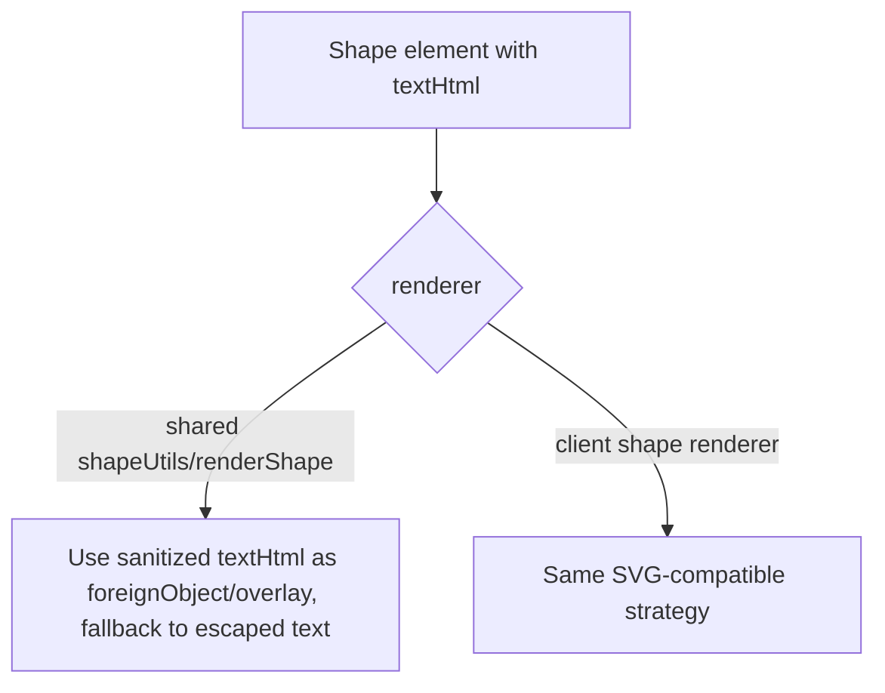

# Phase 6: Shape rich-text preservation + multi-run metadata fidelity

## Context Links

- File: `server/services/pptx-import/mapper/map-shape.js:48-60`
- File: `server/services/pptx-import/mapper/utils-text.js:47-68`
- Bug #10: shape text is flattened to plain text via `plainText(textHtml)` then stored in `element.text` (plain string), while `element.textHtml` keeps the rich HTML separately. The canvas renderer reads `element.text` (plain), so per-run bold/italic/color are lost on render.
- Bug #11: `extractTextMetadata` walks the HTML tree but applies metadata only from the first text run it encounters. Multi-run text (e.g. headings with one styled run + body run) collapses to first-run formatting.

## Overview

**Priority:** P1
**Current status:** implemented
**Brief:** Two related fidelity losses. Bug #10 is fixed by routing the shape renderer to use `textHtml` when present, falling back to `text` for backward compat. Bug #11 needs `extractTextMetadata` to choose the right "summary" run — typically the LONGEST run by character count, since that reflects the dominant style.

## Key Insights

- For shapes, both `text` (plain) and `textHtml` (rich HTML, sanitized) are stored. The renderer currently uses `text`. Switching to `textHtml` requires the renderer to use `dangerouslySetInnerHTML` (server export and client both) — the same pattern as text elements use today.
- For metadata extraction (used for `fontSize`/`fontFamily`/`textColor` summary fields stored on the element), the choice of "which run wins" affects the editor's PropertiesPanel default values. Longest-run-wins is a fair heuristic; alternative is first-run-wins (current bug).
- These are LOW severity individually but compound for non-trivial slides.

## Requirements

**Functional:**

- Shape with `textHtml` renders preserving inline styles (bold/italic/color per run).
- `extractTextMetadata` returns metadata from the run with the most characters (the "dominant" run); ties broken by document order.
- For pure single-run text, behavior is identical to before.

**Non-functional:**

- Both shared HTML/present and client canvas renderers updated to honor `textHtml` for shape.
- Rendering strategy must be SVG-compatible: use either `<foreignObject>` inside the SVG or an absolutely positioned sanitized HTML overlay above the SVG. A plain HTML `<div>` cannot be inserted directly as an SVG child.
- Sanitization: renderers must re-sanitize `textHtml` with the strict shared sanitizer from Phase 1. Do not trust stored `textHtml` as the only security control.

## Architecture

### Bug #10 — Shape rich-text



### Bug #11 — Multi-run metadata

Change `extractTextMetadata` to:
1. Walk every text node, accumulating `[ {text, inheritedStyle} ]`.
2. Pick the entry with the largest `text.replace(/\s+/g, ' ').trim().length`.
3. Apply that entry's style as the element metadata.

## Related Code Files

**Modify:**

- `server/services/pptx-import/mapper/utils-text.js` — rewrite `extractTextMetadata` walker.
- `shared/src/element-renderers.js` and `shared/src/shapeUtils.js` — shape output honors sanitized `textHtml` via a concrete SVG-compatible path.
- `client/src/components/canvas/element-renderers/shape-element-renderer.jsx` — same strategy for editor canvas.
- `server/services/pptx-import/mapper/utils-text.test.js` — multi-run cases.
- `shared/tests/element-renderers.test.js` — shape with textHtml case.

**Read for context:**

- Existing client shape renderer — confirm React's safe HTML pattern.

**Create:**

- None.

**Delete:**

- None.

## Implementation Steps

### Step 1 — Red: failing tests

`utils-text.test.js`:

```js
test('extractTextMetadata picks dominant (longest) run', () => {
  // Two runs: short bold red, long regular black
  const html = '<span style="font-weight: bold; color: red; font-size: 24px">Hi</span><span style="color: black; font-size: 14px">This is the dominant body run with more characters.</span>'
  const meta = extractTextMetadata(html)
  expect(meta.fontSize).toBe(14)
  expect(meta.textColor).toBe('black')
})

test('single-run text behavior unchanged', () => {
  const html = '<span style="font-size: 24px; color: red">Only run</span>'
  const meta = extractTextMetadata(html)
  expect(meta.fontSize).toBe(24)
  expect(meta.textColor).toBe('red')
})
```

`shared/tests/element-renderers.test.js`:

```js
test('shape with textHtml renders rich content, falls back to plain text otherwise', () => {
  const richHtml = renderShape({ type: 'shape', shape: 'rect', textHtml: '<b>Bold</b> rest', text: 'Bold rest', /*...*/ })
  expect(richHtml).toMatch(/<b>Bold<\/b>/)
  const plainHtml = renderShape({ type: 'shape', shape: 'rect', text: 'Plain', /*...*/ })
  expect(plainHtml).toMatch(/Plain/)
})
```

Run — expect failures.

### Step 2 — Green: rewrite `extractTextMetadata`

```js
function extractTextMetadata(html, element = {}) {
  const baseStyle = buildBaseTextStyle(element)
  const fallback = {}
  applyTextStyle(fallback, baseStyle)

  const runs = []
  const walk = (node, inheritedStyle) => {
    if (!node) return
    if (node.type === 'text') {
      const text = String(node.text || '').replace(/\s+/g, ' ').trim()
      if (text) runs.push({ text, style: inheritedStyle })
      return
    }
    const nextStyle = node.type === 'element' ? mergeInlineStyle(inheritedStyle, node) : inheritedStyle
    for (const child of node.children || []) walk(child, nextStyle)
  }
  walk(parseHtmlTree(html), baseStyle)

  if (!runs.length) return fallback
  const dominant = runs.reduce((winner, candidate) =>
    candidate.text.length > winner.text.length ? candidate : winner, runs[0])

  const metadata = {}
  applyTextStyle(metadata, dominant.style)
  return { ...fallback, ...metadata }
}
```

### Step 3 — Green: renderers honor `textHtml`

In shared rendering, update the actual shape output path (`shared/src/shapeUtils.js`, reached from `shared/src/element-renderers.js`) rather than only a pseudocode helper. Use sanitized HTML in a `foreignObject` or an overlay. Tests must call the real exported render path.

```js
const innerContent = element.textHtml
  ? sanitizeRichTextHtml(element.textHtml)
  : escapeHtml(element.text || '')
```

In React client shape renderer, do not put a `<div>` directly under `<svg>`. Choose one:

```jsx
// Option A: foreignObject inside the SVG, sized to the shape bounds.
<foreignObject x={padding.left} y={padding.top} width={innerWidth} height={innerHeight}>
  <div dangerouslySetInnerHTML={{ __html: sanitizeRichTextHtml(element.textHtml) }} />
</foreignObject>
```

or render an absolutely positioned HTML overlay sibling above the SVG. Either way, add DOM/Playwright coverage for centering, clipping, rotation, and selection handles.

### Step 4 — Verification

```bash
npx vitest run server/services/pptx-import/mapper/utils-text.test.js \
  server/services/pptx-import/mapper/map-shape.test.js \
  shared/tests/element-renderers.test.js \
  server/services/pptx-import/mapper-golden-master.test.js
npm run test:corpus
```

Golden-master snapshot may shift on shapes with multi-run text — re-baseline.

## Todo List

- [x] Step 1: write failing tests for longest-run metadata + textHtml rendering
- [x] Step 2: rewrite `extractTextMetadata`
- [x] Step 3: update shared + client shape renderers
- [x] Step 4: re-baseline golden-master snapshot
- [x] Verification suite

## Evidence

- Focused Phase 6 verification passed: `npx vitest run server/services/pptx-import/mapper/utils-text.test.js server/services/pptx-import/mapper/map-shape.test.js server/services/pptx-import/mapper.test.js server/services/pptx-import/mapper-golden-master.test.js shared/tests/shapeUtils.test.js shared/tests/element-renderers.test.js shared/tests/content-safety.test.js client/src/components/canvas/element-renderers/shape-element-renderer.test.jsx client/src/utils/content-safety.test.js` -> 9 files / 182 tests passed.
- Post-review regression slice passed after fixing parent-style aggregation: `npx vitest run server/services/pptx-import/mapper/utils-text.test.js server/services/pptx-import/mapper/map-shape.test.js server/services/pptx-import/mapper.test.js shared/tests/shapeUtils.test.js shared/tests/content-safety.test.js client/src/components/canvas/element-renderers/shape-element-renderer.test.jsx client/src/utils/content-safety.test.js` -> 7 files / 153 tests passed.
- Corpus gate passed: `npm run test:corpus` -> 11/11 decks, 100.0% semantic, 100.0% round-trip.
- Compile gate passed: `npm run build`.
- Lint gate passed with 0 errors; 7 warnings remain from unrelated untracked `CWorkNavSlidesEditordebug-pptx-parse.cjs`.
- Code-reviewer re-review status: DONE; no remaining Phase 6 concerns.

## Success Criteria

- All new tests pass.
- Manual: import a deck with a shape labeled "BIG TITLE (small subtitle)". The shape's PropertiesPanel fontSize reflects the subtitle size (longer run), not the title size. Canvas rendering preserves both runs visually.
- Corpus: no regression.

## Risk Assessment

| Risk | Likelihood | Impact | Mitigation |
|------|------------|--------|------------|
| Longest-run heuristic surprises users who expect the title (first run) to win | M | M | Document in changelog. Future enhancement: choose by frequency-weighted style. Open as follow-up. |
| `dangerouslySetInnerHTML` for shape text is a new XSS surface in client/shared shape renderers | L | H | Same strict sanitizer as Phase 1, with tests for unsafe tags, event attrs, `url(...)`, malformed attrs, and dangerous CSS tokens. |
| Server-side renderer (`shared/src/element-renderers.js`) is used in offline HTML export — textHtml must be CSP-safe | L | M | Re-sanitize in the shared renderer and add an integration test asserting no `<script>` or dangerous CSS survives. |

## Security Considerations

- `textHtml` is sanitized at import time via `sanitizeHtml` and re-sanitized at every render boundary using the strict shared sanitizer.
- Server/shared export renderer must not trust stored values blindly.

## Next Steps

- Phase 7 (text insets) tackles the last LOW-severity bug. Independent.
