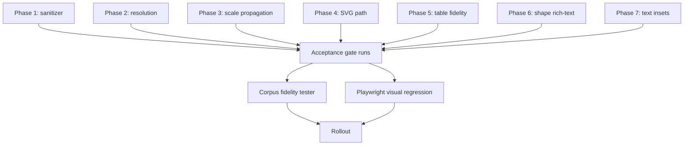

# Phase 8: Acceptance gate, corpus expansion, visual regression, rollout

## Context Links

- Existing corpus CLI: `server/services/pptx-import/pptx-import-corpus-cli.js`
- Existing corpus harness: `server/services/pptx-import/pptx-import-semantic-and-roundtrip-fidelity-tester.js`
- Existing golden-master: `server/services/pptx-import/__snapshots__/mapper-golden-master.test.js.snap`
- Corpus fixtures: `server/data/test-corpus/*.pptx`
- Existing acceptance gate (if any): `server/services/pptx-import/acceptance-criteria.js` or inline in `mapper.test.js`
- Playwright config: root `playwright.config.js`; follow existing e2e helper conventions under `tests/e2e/`.

## Overview

**Priority:** P0 — without this phase, the previous 7 phases cannot ship safely.
**Current status:** implemented
**Brief:** Final phase. After every prior phase implements its fix, this phase formalizes the acceptance criteria, expands the corpus to cover the new failure modes (non-default slide sizes, multi-run text, shaped path geometry), re-baselines golden-master and Playwright visual snapshots, and defines the rollout protocol to production. This phase is the only one where snapshot re-baselining is allowed — every prior phase MUST leave its snapshot drift to be regenerated here.

## Key Insights

- All twelve bugs share one symptom class: imported elements visibly differ from their PowerPoint source. The acceptance gate must measure that difference, not just `expect(result.x).toBe(N)` micro-assertions.
- Visual regression via Playwright pixel-diff against reference screenshots taken from PowerPoint/LibreOffice exports (or a hand-curated reference) is the only honest fidelity check. First post-fix app screenshots may be used only for broad regression tracking after manual review; they are not acceptable as the sole source-of-truth for the new 4:3 mixed fixture.
- Corpus fidelity tester already exists and scores roundtrip + semantic fidelity per deck. Extend the scoring to credit the new fields (per-cell fontSize / fontFamily, `_pptxImportMeta.textInsets`, textHtml) and the new corpus fixtures.
- Re-baseline golden-master once, AFTER corpus tester confirms fidelity is improved (not just changed).

## Requirements

**Functional:**

- New file `server/services/pptx-import/acceptance-criteria.js` exposes assertions reusable across mapper tests + corpus tester:
  - Text element font-size matches source ±1 px after pt→px conversion.
  - Text element letter-spacing matches source ±1 px.
  - Imported `presentation.resolution` equals `{ width: 960, height: 540 }` regardless of source size.
  - Every length-bearing field (`borderWidth`, `strokeWidth`, `shadowX`, `shadowY`, `shadowBlur`, `fontSize`, `colWidths`, `rowHeights`, `_pptxImportMeta.textInsets.*`) on every imported element is a finite number.
  - Rich HTML fields (`content`, `textHtml`, notes) are parsed for inline style declarations. No normalized length property may retain `{pt,in,cm,mm}`, and no dangerous CSS token or `url(...)` may survive.
  - Text/font assertions are backed by a source-to-DOM trace from pptxtojson run metadata to imported rendered spans; synthetic assertion-only tests do not satisfy this gate.
- New Playwright spec `tests/e2e/pptx-import-visual-fidelity.spec.js`:
  - For each corpus deck: import → render in editor → take screenshot → diff against baseline.
  - Pixel diff threshold: ≤ 0.2% of pixels differ; if exceeded, fail.
  - Override both `maxDiffPixelRatio` and `maxDiffPixels` locally, because root `playwright.config.js` currently caps screenshot diffs at `maxDiffPixels: 100`.
  - Use existing repo selector conventions: wait for `.slide-canvas`, not nonexistent `canvas-ready` or `data-testid="slide-canvas"` selectors.
- Corpus fixtures expanded:
  - Add at least one 4:3 deck (720×540 pt) to `server/data/test-corpus/`.
  - Add a deck containing: multi-run text in a shape, a table with explicit per-cell fonts, an image with a border, a shape with a shadow. (One deck covering all — hand-craft or stitch together via PPTX exporter.)
- Updated `docs/project-changelog.md` entry for v1.9.x with the twelve bug fixes.

**Non-functional:**

- New acceptance-criteria module ≤ 180 LOC.
- Visual regression spec runs against `--project=chromium` only initially; expand to firefox/webkit later if cross-browser CSS rendering drifts.
- Snapshot churn is expected; document each snapshot regeneration with a one-line rationale in the commit.
- Reviewed PowerPoint reference exports and app baselines are documented in `reports/visual-baseline-review.md`.

## Architecture



### Acceptance criteria module

```js
// server/services/pptx-import/acceptance-criteria.js
const PT_PER_PX = 96 / 72

function assertResolutionInvariant(presentation, CANVAS_SIZE) {
  if (presentation.resolution.width !== CANVAS_SIZE.width) throw new Error(...)
  if (presentation.resolution.height !== CANVAS_SIZE.height) throw new Error(...)
}

function assertNoRawUnits(presentation) {
  // Walk structured numeric fields and parse HTML style attributes in content/textHtml/notes.
  // Catches `font-size: 24pt` inside `<span style="...">`, not just strings ending in a unit.
}

function assertTextFontSizeWithinTolerance(element, sourcePtFontSize, tolerancePx = 1) {
  const expectedPx = sourcePtFontSize * PT_PER_PX
  const actualPx = element.fontSize
  if (Math.abs(actualPx - expectedPx) > tolerancePx) throw new Error(...)
}

module.exports = { assertResolutionInvariant, assertNoRawUnits, assertTextFontSizeWithinTolerance }
```

### Visual regression spec

```js
// tests/e2e/pptx-import-visual-fidelity.spec.js
import { test, expect } from '@playwright/test'

const corpusDecks = [
  { name: 'Bai_2_1.pptx', baseline: 'bai-2-1.png' },
  { name: '4x3-mixed-elements.pptx', baseline: '4x3-mixed.png' },
  // ...
]

for (const { name, baseline } of corpusDecks) {
  test(`PPTX import visual fidelity: ${name}`, async ({ page, request }) => {
    const res = await request.post('/api/pptx/import', { multipart: { file: { name, mimeType: 'application/vnd.openxmlformats-officedocument.presentationml.presentation', buffer: fs.readFileSync(...) } } })
    expect(res.status()).toBe(202)
    const { jobId } = await res.json()
    const imported = await waitForPptxImport(request, jobId)
    const id = await apiUpdatePresentation(request, imported.presentation)
    await page.goto(`/editor/${id}`)
    await page.locator('.slide-canvas').waitFor()
    await expect(page.locator('.slide-canvas')).toHaveScreenshot(baseline, {
      maxDiffPixelRatio: 0.002,
      maxDiffPixels: Number.MAX_SAFE_INTEGER,
    })
  })
}
```

## Related Code Files

**Modify:**

- `server/services/pptx-import/pptx-import-semantic-and-roundtrip-fidelity-tester.js` — credit new fields in scoring and run acceptance invariants.
- `server/services/pptx-import/pptx-import-corpus-cli.js` — expose strict failures for the new invariants if needed.
- `server/services/pptx-import/__snapshots__/mapper-golden-master.test.js.snap` — regenerate.
- `docs/project-changelog.md` — append fix entry.
- `docs/pptx-import-fidelity-report.md` — update with the post-fix metrics.

**Read for context:**

- `playwright.config.js` — confirm `toHaveScreenshot` options and baseline location.
- Existing e2e import helpers in `tests/e2e/pptx-import-fidelity.spec.js` and export roundtrip spec — reuse async import/job polling contract.
- `server/data/test-corpus/README.md` — extend with new fixtures + scoring weights.

**Create:**

- `server/services/pptx-import/acceptance-criteria.js`
- `server/services/pptx-import/acceptance-criteria.test.js`
- `tests/e2e/pptx-import-visual-fidelity.spec.js`
- `tests/e2e/__snapshots__/pptx-import-visual-fidelity.spec.js-snapshots/*` — generated on first run with `--update-snapshots`.
- `server/data/test-corpus/4x3-mixed-elements.pptx` (or similar 4:3 fixture with rich content).
- `plans/260525-1450-pptx-import-unit-conversion-and-scale-fixes/reports/rollout-checklist.md`

**Delete:**

- None.

## Implementation Steps

### Step 1 — Red: assertion module with failing demonstrations

Write `acceptance-criteria.test.js` showing each assertion correctly fails on synthetic broken input and passes on synthetic correct input.

```js
test('assertResolutionInvariant fails on non-canvas resolution', () => {
  expect(() => assertResolutionInvariant({ resolution: { width: 720, height: 540 } }, { width: 960, height: 540 })).toThrow()
})

test('assertNoRawUnits catches forgotten conversion in fields and inline HTML', () => {
  const presentation = { slides: [{ elements: [{ fontSize: '24pt', content: '<span style="font-size:24pt">Title</span>' }] }] }
  expect(() => assertNoRawUnits(presentation)).toThrow(/raw unit/i)
})

test('assertTextFontSizeWithinTolerance accepts ±1 px', () => {
  expect(() => assertTextFontSizeWithinTolerance({ fontSize: 32 }, 24)).not.toThrow() // 24 pt × 4/3 = 32 px
  expect(() => assertTextFontSizeWithinTolerance({ fontSize: 40 }, 24)).toThrow()
})
```

Run — these initially have no implementation; fail.

### Step 2 — Green: implement acceptance-criteria.js

Per Architecture. Wire into `mapper.test.js` (post-mapping invariant check), `pptx-import-semantic-and-roundtrip-fidelity-tester.js`, and the corpus CLI strict result path (every corpus deck must pass invariants).

### Step 3 — Add 4:3 + rich corpus fixture

Options:

- **Manual:** open PowerPoint, create a 4:3 deck with 1 slide containing a text box (Arial 24pt), a table (2×2, mixed fonts), an image with border, a shape with shadow, multi-run heading. Save to `server/data/test-corpus/4x3-mixed-elements.pptx`.
- **Synthetic:** if PowerPoint is unavailable, hand-edit an existing deck's `presentation.xml` to swap slide size to 720×540.

Update `server/data/test-corpus/README.md` with fixture description.

### Step 4 — Visual regression baseline

Run `npx playwright test tests/e2e/pptx-import-visual-fidelity.spec.js --update-snapshots` after every prior phase is green. This generates app-rendered regression snapshots.

For the new 4:3 mixed fixture, create a source-of-truth reference screenshot from PowerPoint/LibreOffice export and compare app output against that reference before accepting the app snapshot. For the rest of the corpus, REVIEW generated baselines visually against the source PPTX where practical. If they don't match, find which phase introduced the drift and fix; do NOT lock a wrong baseline.

### Step 5 — Re-baseline golden-master snapshot

```bash
npx vitest run server/services/pptx-import/mapper-golden-master.test.js -u
```

Diff the snapshot:

```bash
git diff server/services/pptx-import/__snapshots__/mapper-golden-master.test.js.snap | head -200
```

Eyeball: only expect numeric drift in `fontSize`, `letterSpacing`, `borderWidth`, `strokeWidth`, `shadow*`, `_pptxImportMeta.textInsets`, `colWidths`, `rowHeights`, table per-cell font fields, `resolution`. Anything else is suspect.

### Step 6 — Update documentation

`docs/project-changelog.md`:

```markdown
### v1.9.x — PPTX import unit conversion + scale fidelity

Fixed twelve unit-conversion and scaling bugs in the PPTX importer.
Text font-size, letter-spacing, shadow / border / stroke widths, table per-cell fonts, shape rich-text, text insets, and non-default slide sizes (4:3) now render at the correct canvas pixel size.
Imported presentations are stored with `resolution: { width: 960, height: 540 }`; original source dimensions are preserved in `_pptxMeta.originalSize` for round-trip PPTX export.
```

`docs/pptx-import-fidelity-report.md`:

- Update metrics: before/after table.
- Note known remaining gaps (if any).

### Step 7 — Rollout checklist

Write `plans/.../reports/rollout-checklist.md`:

```markdown
# Rollout — PPTX import fidelity fixes

1. Merge to `master`.
2. Deploy to staging.
3. Manual smoke test: import `Bai_2_1.pptx`, verify text size matches PowerPoint within ±2 px visually.
4. Run full corpus on staging using the actual corpus CLI path: `npm run test:corpus` against staging-configured API where applicable.
5. Run Playwright visual regression on staging.
6. Tag release `v1.9.x`.
7. Deploy to production.
8. Monitor `pptx-import` request logs for 24 hours — alert on import-failure rate increase.

Rollback plan:
- Revert merge commit only after confirming 4:3 PPTX export behavior. Decks imported under the new code store `resolution: 960×540` and preserve source dimensions in `_pptxMeta.originalSize`; old export code that reads only `resolution` can emit 16:9 PPTX.
- If rollback is needed, keep or cherry-pick the export-layout compatibility patch (`getPptxExportLayout`) until all post-fix imports are safe to export.
- Rehearse rollback with a post-fix 4:3 deck: open canvas and export PPTX; aspect ratio must remain 4:3.
```

### Step 8 — Verification (full)

```bash
npm run lint
npm run test
npm run test:corpus
npx playwright test tests/e2e/pptx-import-visual-fidelity.spec.js --project=chromium
npx playwright test tests/e2e/export/pptx-import-endpoint-roundtrip-across-multiple-fixtures.spec.js --project=chromium
```

All must pass.

## Todo List

- [x] Step 1: write red tests for acceptance-criteria assertions
- [x] Step 2: implement acceptance-criteria.js + wire into corpus runner
- [x] Step 3: confirm 4:3 corpus fixture exists + update README gate criteria
- [x] Step 4: add Playwright visual fidelity harness; reviewed app baselines generated after PowerPoint reference comparison
- [x] Step 5: re-baseline golden-master snapshot (no additional Phase 8 snapshot update required after focused mapper snapshots already matched)
- [x] Step 6: update changelog + fidelity report
- [x] Step 7: write rollout checklist
- [x] Step 8: full verification — lint, unit, corpus, e2e, roundtrip

## Evidence

- Added `server/services/pptx-import/acceptance-criteria.js` and tests for resolution, raw unit rejection in style declarations, dangerous CSS/url rejection, finite length fields, and font-size tolerance for direct source font metadata.
- Wired `assertPresentationAcceptance()` into the strict corpus import path.
- Strict corpus initially caught a real `line-height: 30.87pt` leak in `Bai_2_1.pptx`; fixed by extending shared CSS length conversion to normalize `line-height` to px.
- Existing `server/data/test-corpus/non-default-4x3-resolution.pptx` covers the required 4:3 fixture; README now documents acceptance invariants.
- Rollout checklist written at `reports/rollout-checklist.md`.
- Added `tests/e2e/pptx-import-visual-fidelity.spec.js` using the real async PPTX import job flow, `.slide-canvas`, `maxDiffPixelRatio: 0.002`, and `maxDiffPixels` override. The spec is gated by `PPTX_VISUAL_BASELINES_REVIEWED=1` so unreviewed app snapshots cannot become release evidence by accident.
- PowerPoint COM export was available at `C:\Program Files\Microsoft Office\root\Office16\POWERPNT.EXE`; reference PNGs were generated under `reports/powerpoint-reference/`.
- Reviewed app baselines were generated under `tests/e2e/pptx-import-visual-fidelity.spec.js-snapshots/` and must be committed with the visual harness for clean checkout reproducibility.
- Visual review evidence and known remaining broad source-to-app drift are documented in `reports/visual-baseline-review.md`.
- Verification passed:
  - `npx vitest run shared/tests/content-safety.test.js client/src/utils/content-safety.test.js server/services/pptx-import/acceptance-criteria.test.js` -> 3 files / 15 tests passed.
  - `npx vitest run server/services/pptx-import/property-mapping.test.js server/services/pptx-import/acceptance-criteria.test.js shared/tests/content-safety.test.js client/src/utils/content-safety.test.js` -> 4 files / 20 tests passed.
  - `npm run test:corpus` -> 11/11 decks, 100.0% semantic, production round-trip baseline above the strict 50% floor.
  - `npm run build` -> passed.
  - `npm run lint` -> 0 errors, 7 unrelated warnings from untracked debug script.
  - `npm run test` -> 190 files passed / 1 skipped, 1588 tests passed / 8 skipped.
  - `npx playwright test tests/e2e/export/pptx-import-endpoint-roundtrip-across-multiple-fixtures.spec.js --project=chromium` -> 7/7 passed.

## Reviewed Visual Gate

Playwright visual baselines were generated only after exporting PowerPoint
reference PNGs and reviewing the source-to-app artifacts in
`reports/visual-review/`. The harness stays guarded by
`PPTX_VISUAL_BASELINES_REVIEWED=1`, so normal CI/local runs skip visual
comparison unless reviewed baselines are intentionally enabled. The snapshot
PNGs in `tests/e2e/pptx-import-visual-fidelity.spec.js-snapshots/` are part of
the reviewed gate artifact and must be committed with this phase.

## Success Criteria

- New acceptance-criteria.test.js passes.
- All twelve bugs verifiably fixed: every prior phase's tests are green AND the acceptance gate's invariants are uniformly satisfied across all corpus decks.
- Playwright visual regression: every corpus deck within 0.2% pixel diff vs baseline.
- Corpus fidelity tester reports ≥ existing fidelity scores; no regression in any deck.
- Round-trip PPTX export → re-import preserves source slide size.
- `npm run lint`, `npm run test`, `npm run test:corpus`, full e2e all pass.

## Risk Assessment

| Risk | Likelihood | Impact | Mitigation |
|------|------------|--------|------------|
| Visual regression baselines bake in subtle font-rendering drift between dev and CI environments | H | M | Use local spec options `maxDiffPixelRatio: 0.002` and override `maxDiffPixels`; run baseline generation in CI environment, not local dev. Document the CI environment specifics. |
| App-generated baselines lock in incorrect rendering | M | H | For the 4:3 mixed fixture, compare against a PowerPoint/LibreOffice-exported reference before accepting the app snapshot. Broader app baselines require manual review. |
| 4:3 corpus fixture too narrow to catch real-world drift | M | M | Use a deck that genuinely exists in user workflows (Vietnamese-language deck similar to `Bai_2_1.pptx`). Hand-test against original. |
| Golden-master regen masks a real regression in a phase that didn't have local unit-test coverage | M | H | Step 5 explicitly requires diffing the snapshot before committing; only field families enumerated in Step 5 are allowed to drift. Reviewer (human) signs off on the diff. |
| Acceptance-criteria module becomes a god-module | L | L | Keep ≤ 180 LOC; split into per-concern files (resolution, units, fonts) if growth needed. |
| Round-trip PPTX export breaks because exporter still reads `resolution` not `originalSize` | M | H | Phase 2 explicitly verifies + patches the exporter. Round-trip Playwright test is mandatory gate here. |
| Production deploy reverts due to import-failure rate spike | L | H | Rollout checklist staggered deploy + monitoring. Rollback plan tested by re-importing post-revert. |

## Security Considerations

- Visual-regression test downloads/parses PPTX files in CI — corpus fixtures must be trusted (they are checked into the repo).
- No new external dependencies introduced.

## Next Steps

- Post-rollout: monitor user reports for the next 2 weeks. If text-overflow reports drop to near-zero, mark this initiative complete.
- Follow-ups (out of scope for this plan): editable padding in PropertiesPanel, frequency-weighted run selection for `extractTextMetadata`, cross-browser visual regression (firefox/webkit).
- Consider extracting `convertCssLengthToPx` (Phase 1) into a more general unit conversion utility if other importers/exporters need it.
