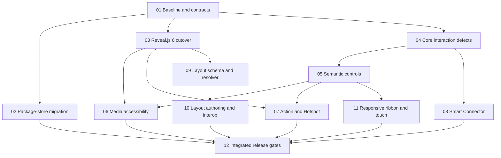

# Controls, Elements, and Reveal.js 6 Deep TDD

## Delivery Contract

### Outcome

Ship one coherent editor/runtime upgrade that:

1. Repairs the confirmed control/data-integrity defects in the current source.
2. Makes Properties, Ribbon, prompts, and compact controls keyboard- and screen-reader-usable.
3. Adds image/media accessibility authoring and validation.
4. Adds Action/Hotspot, Smart Connector, and reusable Slide Master/Layout behavior without multiplying canonical element types.
5. Migrates the server package-store state safely across the current incompatible schema shape.
6. Upgrades the project-owned Reveal.js integration from installed `5.2.1` to latest verified release `6.0.1` across web, offline, export, raster, and Electron paths.

### Constraints

- TDD for every new observable contract: RED -> GREEN -> REFACTOR -> focused regression gate.
- Preserve the existing 19 canonical element types. Action/Hotspot is base-element metadata; Smart Connector extends `line`; Slide Master/Layout is presentation/slide metadata.
- One behavior source per domain. Shared render/export code must consume pure normalized contracts, not editor DOM state.
- Legacy presentations with no new metadata render and round-trip as before.
- Persisted package-store migration must fail closed on corrupt or ambiguous state, publish only under the writer lock, and remain crash-idempotent.
- Reveal.js is server-owned. Dependency, lockfile, copied vendor closure, generated HTML, plugins, preview runtime, offline inlining, and Electron packaging move together.
- Existing URL/media sanitization remains deny-by-default; invalid actions/media become inert with explicit UI/export feedback.
- Vertical child slides, locks, groups, undo/redo, autosave, copy/duplicate, offline HTML, and PPTX are first-class acceptance paths.

### Non-goals

- No generic workflow/event engine, arbitrary JavaScript actions, trigger chains, or action-animation sequencing.
- No new `hotspot` or `connector` element discriminator.
- No orthogonal/Bezier auto-routing, collision avoidance, connector-to-connector graphs, or cross-slide connectors.
- No PowerPoint-native master hierarchy preservation, cross-deck linked masters, constraint solver, or hard safe-area clipping.
- No automatic synthesis of masters from imported PPTX decks; import remains flattened and explicit.
- No silent rewriting of historical package-store indexes or guessing missing/corrupt authority data.
- No unrelated redesign of the editor shell or absorption of external Docker/PPTX-oracle blockers from the broader release plan.

### Acceptance Evidence

- Focused unit/component suites fail before each implementation and pass after it.
- Browser smoke proves editor/presentation separation, keyboard/focus behavior, narrow ribbon behavior, connectors, layouts, and actions.
- Reveal 6.0.1 asset closure works in present, share, preview, offline HTML, PDF/raster, PPTX-related render paths, and packaged Electron verification.
- A copied legacy package-store fixture migrates once, survives restart and injected publish crashes, and rejects corrupt/ambiguous legacy shapes.
- `npm run matrix:gate`, `npm run lint`, `npm run build`, applicable focused suites, and the integrated smoke matrix are green.
- Feature inventory, compatibility matrix, README/docs/changelog describe exactly what is preserved, flattened, warned, or unsupported.

## Confirmed Current Evidence Snapshot

- Canonical inventory remains 19 types in `client/src/data/element-defaults.js` and `shared/src/types/presentation.js`; Action/Hotspot is base-element metadata and Smart Connector extends `line`.
- Reveal.js `6.0.1` is the only shipped runtime. `shared/src/reveal-runtime-assets.js` owns the manifest and the published closure under `/vendor/reveal.js/dist`, including built-in plugins under `dist/plugin/`.
- Semantic prompts and extracted modal composition provide the dialog/focus contract; no obsolete native prompt path remains.
- The confirmed delete/fan-out defects and package-store migration boundary are covered by their completed contracts.
- Built-in templates remain materialized slides through `SLIDE_TEMPLATES`; reusable layout masters are a separate bounded registry resolved into effective slides.
- Images support alternative/decorative/long-description metadata; video/audio support bounded track, transcript, and audio-description metadata with explicit PPTX limits.
- Final gates: Vitest 1,419/1,419 suites (4,745 passed, 0 failed, 3 skipped of 4,748 tests); Playwright Chromium/tablet 441 passed, 0 failed, 1 skipped; audit 37/37; lint/build/docs-build/vendor/runtime/matrix/PPTX package boundary green.
- Release evidence is recorded in `plans/reports/260824-controls-elements-reveal-upgrade-release-evidence.json` and generated from `scripts/feature-inventory/run-results-{vitest,playwright}.json` plus `scripts/feature-inventory/reports/feature-coverage-matrix.json`; the Playwright report excludes `config.webServer.env`.
- Actual-browser master authoring smoke persisted Inspector X 380 -> 420 and copy/paste fixed-elements 1 -> 2 without changing the active slide.

## External Version Sources

- Reveal.js 6.0.1 official release: <https://github.com/hakimel/reveal.js/releases/tag/6.0.1>
- Official Reveal.js 5 -> 6 upgrade guide: <https://revealjs.com/upgrading/#upgrading-from-version-5-to-6>
- Published package metadata: <https://registry.npmjs.org/reveal.js/latest>

## Architecture Decisions

1. **Package-store version split.** Introduce explicit root/state/head schema versions. Parse and hash-check legacy data, migrate only supported legacy shapes in memory, validate the current shape, then publish one successor after writer acquisition.
2. **Shared URL/action policy.** Replace client/shared policy drift with one dependency-free validator/normalizer consumed by rich text, element actions, Reveal rendering, and PPTX export.
3. **Action/Hotspot as metadata.** `BaseElement.action` carries validated navigation/action metadata. Invisible hotspot mode uses existing element geometry and presentation-only rendering; edit mode always selects/edits and never navigates.
4. **Smart Connector as `line` metadata.** `line.connections.start/end` persist target IDs and finite anchor IDs; existing endpoint coordinates remain the last resolved fallback and native PPTX flattening source.
5. **Slide layout resolver.** Add a normalized `layoutMasters` registry and per-slide references/overrides. Built-in templates compile through an adapter; effective elements are resolved by one pure shared helper for editor, Reveal/offline, and PPTX.
6. **Reveal clean cutover.** Upgrade directly to `6.0.1`, regenerate the vendor closure, update all `dist/plugin` URLs/inlining rules, and remove old-path support after migration.
7. **Explicit export degradation.** HTML/offline paths preserve supported semantics. PPTX uses native capabilities only when proven; otherwise it flattens with deterministic warnings rather than silently dropping behavior.

## Cross-Plan Relationship

- Source audit: `plans/reports/260713-elements-controls-interactions-audit-report.md`.
- Historical plan references are preserved, but two literal July names previously cited by this plan do not exist at those paths. Reconciliation maps their remaining-work intent to `plans/archive/260709-0917-verified-element-control-interaction-defects-deep-tdd/` and `plans/archive/260705-1430-element-capability-source-of-truth-remediation-deep-tdd/`. These archived plans remain historical evidence and are not rewritten.
- Completed historical plans under `plans/archive/` remain evidence only; they are not proof of current behavior and must not be edited to claim completion.
- `plans/260820-0235-full-codebase-review/` remains the broader release plan. This plan does not resolve its unrelated external Docker/PPTX oracle prerequisites.

## Dependency Graph

Phases 02, 03, and 04 may run in parallel after Phase 01. Phases 06, 07, 08, 10, and 11 may run in parallel once their incoming dependencies are green. Phase 12 is the only completion gate.

## Phases

| # | Phase | Depends on | Status |
|---|---|---|---|
| 01 | [Baseline, fixtures, and contract lock](./phase-01-baseline-contracts.md) | - | Complete (18/18, 100%) |
| 02 | [Package-store legacy state migration](./phase-02-package-store-state-migration.md) | 01 | Complete (21/21, 100%) |
| 03 | [Reveal.js 6.0.1 asset and runtime cutover](./phase-03-revealjs-6-cutover.md) | 01 | Complete (22/22, 100%) |
| 04 | [Core interaction and fan-out defects](./phase-04-core-interaction-defects.md) | 01 | Complete (18/18, 100%) |
| 05 | [Semantic control and prompt accessibility](./phase-05-semantic-control-accessibility.md) | 04 | Complete (20/20, 100%) |
| 06 | [Image and media accessibility metadata](./phase-06-media-accessibility.md) | 03, 05 | Complete — accepted browser semantics and explicit PPTX limits |
| 07 | [Action and Hotspot metadata](./phase-07-action-hotspot.md) | 03, 05 | Complete — validated browser runtime and warned PPTX omission |
| 08 | [Smart Connector metadata and geometry](./phase-08-smart-connectors.md) | 04 | Complete — resolved endpoints and warned PPTX flattening |
| 09 | [Slide Master/Layout schema and resolver](./phase-09-layout-schema-resolver.md) | 03 | Complete — shared effective-slide resolution |
| 10 | [Slide Master/Layout authoring and interop](./phase-10-layout-authoring-interop.md) | 05, 09 | Complete — linked authoring and no-native-master export boundary |
| 11 | [Responsive ribbon, active reveal, and touch targets](./phase-11-responsive-ribbon-touch.md) | 05 | Complete — compact/standard/wide workspace and Ribbon contracts |
| 12 | [Integrated release, documentation, and rollback gates](./phase-12-integrated-release-gates.md) | 02, 06, 07, 08, 10, 11 | Complete (100%) |

All 12 phases are complete. External Docker/LibreOffice/PPTX-oracle prerequisites remain owned by the broader release plan and are not claimed here.

## Global TDD Rules

For every phase:

1. Add or tighten the smallest behavior-level test that fails for the intended reason.
2. Record the RED command/output in the phase work log before production edits.
3. Implement at the canonical source boundary; migrate every caller in the same phase.
4. Re-run the focused test to GREEN.
5. Refactor only after GREEN; remove obsolete branches, old asset paths, native prompts, and duplicate schema/policy sources.
6. Run the phase regression gate. A green unrelated suite does not prove the changed contract.
7. Browser/UI phases must exercise the actual surface, not stop at component tests.

## Global Scenario Matrix

Every applicable feature must cover:

- Top-level and vertical child slides.
- Locked slide, locked element, hidden slide, group, multi-selection, duplicate/copy/paste, delete, undo/redo, autosave/reload.
- New deck, legacy deck with absent metadata, malformed imported metadata, missing references, and recovery after restart.
- Editor canvas, live presentation, preview iframe, share route, offline HTML, PDF/raster, PPTX export/import policy, and Electron vendor closure.
- Keyboard-only, screen reader names/roles/states, focus restoration, narrow width, tablet touch, reduced motion, and visible focus.
- Unsafe URL/media schemes, missing slide/connector/layout targets, unsupported export capability, and deterministic warning behavior.

## Completion Criteria

- [x] Legacy package-store fixtures migrate exactly once and crash/restart tests pass.
- [x] Reveal.js `6.0.1` is the only shipped Reveal runtime; no stale `/vendor/reveal.js/plugin/*` references remain.
- [x] Confirmed editor control defects have behavior-level regression tests.
- [x] Properties, Ribbon, prompts, repeated rows, and destructive controls expose unique accessible names and correct keyboard behavior.
- [x] Images support alt/decorative/long-description metadata; video/audio support caption/transcript metadata with explicit export limits.
- [x] Action/Hotspot works in presentation/offline, remains inert in edit mode, and rejects unsafe/missing targets.
- [x] Smart connectors follow targets in one history/autosave transaction and flatten deterministically for PPTX.
- [x] Layout-linked slides render through the shared effective resolver across canvas, Reveal/offline, and PPTX flattening; detach is lossless and explicit.
- [x] Active Ribbon tabs remain visible at narrow widths; tablet controls meet the chosen target-size contract without desktop regressions.
- [x] Feature inventory, compatibility matrix, docs, changelog, lint, build, focused tests, browser smoke, and runtime closure gates pass.

## Phase 06–11 Accepted Capability Reconciliation

The canonical editor-core, executable contract-layer smoke capabilities are:

| Capability | Accepted behavioral boundary |
| --- | --- |
| `media.accessibility` | Image alternatives and media accessibility metadata render in browser paths; unsupported PPTX semantics warn. |
| `action.element-runtime` | Valid actions dispatch only in browser presentation paths; editor mode is inert and PPTX omits browser-only actions with warnings. |
| `connector.smart-geometry` | Same-slide attachments resolve to finite endpoints and preserve a free-coordinate fallback. |
| `layout.master-resolution` | Canvas and browser/export paths use one effective-slide layout/master resolver. |
| `control.ribbon.responsive` | Compact, standard, and wide Ribbon/workspace behavior preserves active controls and coarse-pointer targets. |
| `runtime.reveal6-assets` | Reveal.js 6.0.1 assets are manifest-owned under `/vendor/reveal.js/dist`, including `dist/plugin/`. |
| `export.action-pptx` | Browser-only actions are omitted from PPTX and warned; no native-action claim is made. |
| `export.connector-pptx` | Connectors flatten to resolved native lines with an attachment-semantics warning. |
| `export.layout-pptx` | Layouts flatten to resolved objects with warnings; native PowerPoint masters are neither preserved nor synthesized. |
| `export.media-pptx` | Image alt is native where supported; media semantics use explicit semantic/fallback warnings. |

Cleanup audit: no obsolete native prompt, temporary feature flag, migration debug branch, test-only production hook, or dual Reveal runtime path was found. Compatibility migrations and explicit fallbacks remain intentional.

## Unresolved Decisions Deferred to Evidence Gates

- Native PPTX hyperlink support for each non-text renderer must be proven by a generated package inspection before selecting native export; otherwise use warned flattening/fallback.
- Optional third-party Reveal plugins (menu/chalkboard/customcontrols) remain enabled only if Reveal 6 browser smoke proves compatibility; incompatibility is a release blocker or explicit removal decision, not a silent downgrade.
- Touch target minimum is finalized from the existing design-token density and actual 320/768/1024 browser evidence in Phase 11; semantic correctness is mandatory regardless of the final compact visual size.

<!-- slug: controls-elements-reveal-upgrade-deep-tdd -->